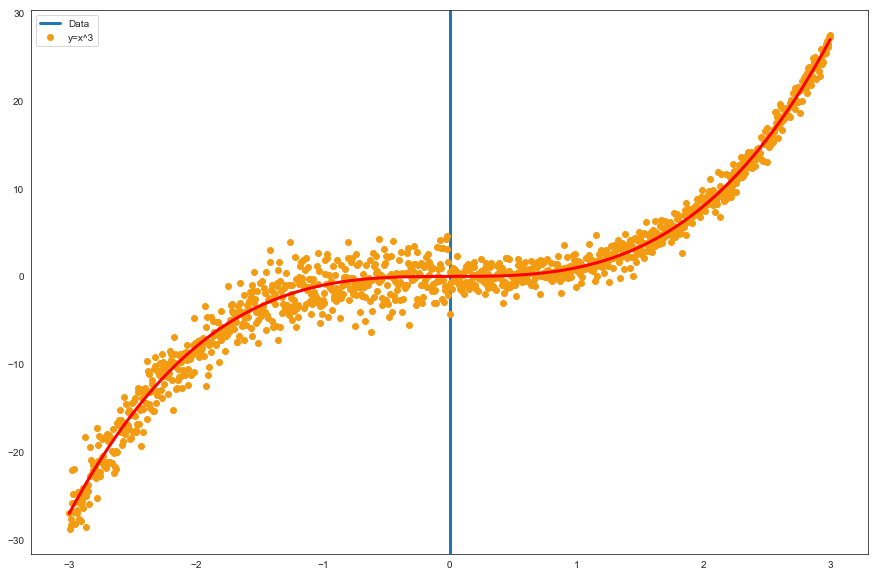
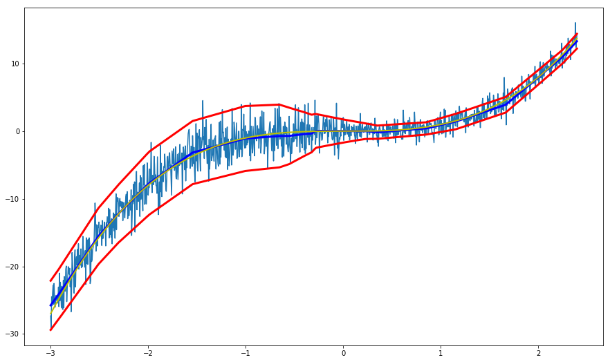
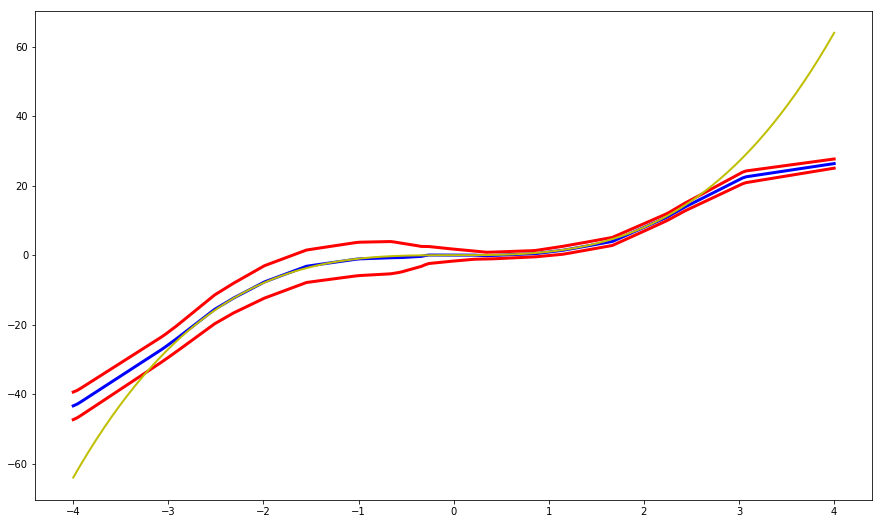
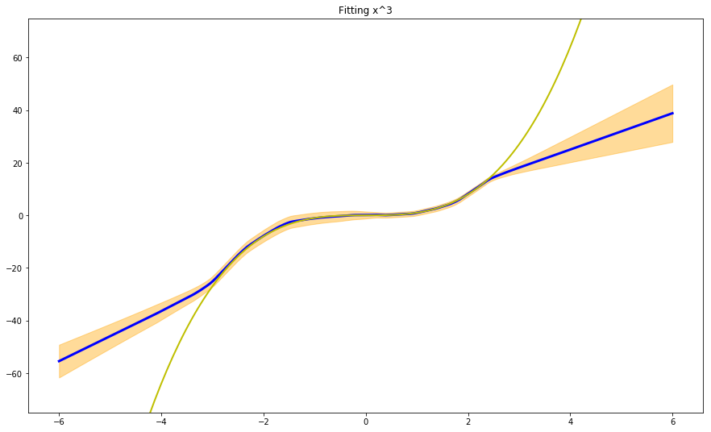
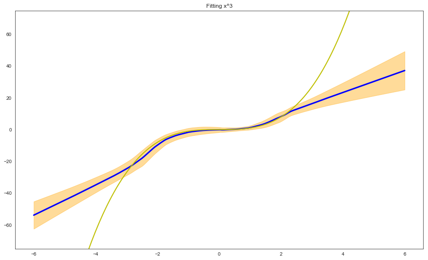

# Paper review & code: Deep Ensembles (NIPS 2017)
## Simple and Scalable Predictive Uncertainty Estimation using Deep Ensembles 

The thing we love about probabilistic programming is of course the possibility to model the uncertainty of model predictions. This convenient property comes with a cost unfortunately, as the calculations needed to perform e.g. Markov Chain Monte Carlo are very expensive.
In this short but insightful paper Lakshminarayanan et al., report a simple method to assess model uncertainty using NNs, which compares well even to Bayesian networks (as they demonstrate in the paper).
These are the key insights presented in the paper:
- Use of a proper scoring rule as the training criterion
- Training of an *ensemble* of NNs
- Use of adversarial training to smooth the predictive distributions

## The scoring rule
Scoring rules assess the quality of probabilistic forecasts by assigning a numerical score based on the predictive distribution and on the event or value that generates. (You may want to check out this nice review [Gneiting et al., 2007] for more information on scoring functions, but it is not required to follow the rest of this post).

Let us concentrate on regression problems for a moment: in this context NNs output a single value () and the weights are optimized via backprop to minimize the Mean Squared Error (MSE) on the training set. Thus, we are not taking into consideration predictive uncertainty at all. In order to change this, the authors propose a slight modification of the final layer of the network so that it produces two outputs: the mean ) and variance  (which of course must be grater than 0) of a Gaussian distribution.

We now minimize the negative log-likelihood criterion by treating the observed value as a sample from a Gaussian distribution with the predicted mean and variance (outputs of the network):


Thus, we need to implement the 1) custom loss function along with a 2) custom Keras layer that outputs both mu and sigma.
I'll take a step back to generate some data we can use to observe the properties of the model and what it really means to predict uncertainty in this context. Let us use the same function (y=x^3) referenced in the paper:

```python
import numpy as np
from matplotlib import pyplot as plt
import seaborn as sns
sns.set_style("white")


test_ratio = 0.1

data_range = 3
data_step = 0.005
data_sigma1 = 2
data_sigma2 = 1

def pow_fun(x):
    return np.power(x, 3)

data_x = np.arange(-data_range, data_range + data_step, data_step)
data_x = np.reshape(data_x, [data_x.shape[0], 1])

data_y = np.zeros([data_x.shape[0], 1])
data_y_true = np.zeros([data_x.shape[0], 1])

for i in range(data_x.shape[0]):

    if (data_x[i,0] < 0): 
        data_y[i, 0] = pow_fun(data_x[i,0]) + np.random.normal(0, data_sigma1)
    else:
        data_y[i, 0] = pow_fun(data_x[i,0]) + np.random.normal(0, data_sigma2)
        
    data_y_true[i, 0] = pow_fun(data_x[i,0])
    
num_train_data = int(data_x.shape[0] * (1 - test_ratio))
num_test_data  = data_x.shape[0] - num_train_data

train_x = data_x[:num_train_data, :]
train_y = data_y[:num_train_data, :]
test_x  = data_x[num_train_data:, :]
test_y  = data_y[num_train_data:, :]

plt.rcParams['figure.figsize'] = [15, 10]
plt.axvline(x=0, linewidth=3)
plt.plot(data_x, data_y, '.', markersize=12, color='#F39C12')
plt.plot(data_x, data_y_true, 'r', linewidth=3)
plt.legend(['Data', 'y=x^3'], loc = 'best')

# plt.title('y = x^3 where $\epsilon$ ~ N(0, 3^2) and N(0, 1^2)')
plt.show()

```


 
The blue vertical line represents the point on the x-axis (0) where we have increased the dispersion of the generated data. We will try to understand if a model like the one presented in the paper can adequately capture the change in dispersion and modulate the output sigma accordingly (on the training set).

And this is the code that generates the loss function and the custom layer:
```python
import tensorflow as tf
from keras import backend as K
from keras.layers import Input, Dense, Layer, Dropout
from keras.models import Model
from keras.initializers import glorot_normal
import numpy as np

def custom_loss(sigma):
    def gaussian_loss(y_true, y_pred):
        return tf.reduce_mean(0.5*tf.log(sigma) + 0.5*tf.div(tf.square(y_true - y_pred), sigma)) + 1e-6
    return gaussian_loss

class GaussianLayer(Layer):

    def __init__(self, output_dim, **kwargs):
        self.output_dim = output_dim
        super(GaussianLayer, self).__init__(**kwargs)

    def build(self, input_shape):
        self.kernel_1 = self.add_weight(name='kernel_1', 
                                      shape=(30, self.output_dim),
                                      initializer=glorot_normal(),
                                      trainable=True)
        self.kernel_2 = self.add_weight(name='kernel_2', 
                                      shape=(30, self.output_dim),
                                      initializer=glorot_normal(),
                                      trainable=True)
        self.bias_1 = self.add_weight(name='bias_1',
                                    shape=(self.output_dim, ),
                                    initializer=glorot_normal(),
                                    trainable=True)
        self.bias_2 = self.add_weight(name='bias_2',
                                    shape=(self.output_dim, ),
                                    initializer=glorot_normal(),
                                    trainable=True)
        super(GaussianLayer, self).build(input_shape) 

    def call(self, x):
        output_mu  = K.dot(x, self.kernel_1) + self.bias_1
        output_sig = K.dot(x, self.kernel_2) + self.bias_2
        output_sig_pos = K.log(1 + K.exp(output_sig)) + 1e-06  
        return [output_mu, output_sig_pos]

    def compute_output_shape(self, input_shape):
        return [(input_shape[0], self.output_dim), (input_shape[0], self.output_dim)]

```

The implementation of the custom loss function is straightforward (although with a twist): we need to encapsulate the loss function `gaussian_loss` into another function in order to pass the second parameter (`sigma`) it needs to compute the log-likelihood (`sigma`).
Then, we can subclass Keras' `Layer` to produce our custom layer. There is an extensive documentation on this, see [Keras documentation](https://keras.io/layers/writing-your-own-keras-layers/), here I will skip the details and just say that we need to implement three methods: `build`, `call`, `compute_output_shape` that are required by the framework. 

In the `build` method we define the two weight matrices + bias we need to perform the forward propagation in the `call` method. Just remember to set the correct output shape (since we are returning a list of elements) in `compute_output_shape`.

We are now ready to train the model and see if it can handle a simple cubic function with added dispersion:

```python
inputs = Input(shape=(1,))
x = Dense(10, activation='relu')(inputs)
x = Dense(6, activation='relu')(x)
x = Dense(30, activation='relu')(x)
mu, sigma = GaussianLayer(1, name='main_output')(x)

model = Model(inputs, mu)
model.compile(loss=custom_loss(sigma), optimizer='adam')
model.fit(train_x, train_y, epochs=400)

```
We also need to create a custom Keras function (which we call `get_intermediate`) to extract mu and sigma results in prediction mode.
```python
layer_name = 'main_output' # Where to extract the output from
get_intermediate = K.function(inputs=[model.input], outputs=model.get_layer(layer_name).output)
```
And plot the results when predicting in the training interval:
```python
preds, sigmas = [], []
for j in range(len(train_x)):
    mu, sigma = get_intermediate([[train_x[j]]])
    preds.append(mu.reshape(1,)[0])
    sigmas.append(sigma.reshape(1,)[0])

plt.figure(1, figsize=(15, 9))
plt.plot([i[0] for i in train_x], [i for i in train_y])
plt.plot([i[0] for i in train_x], [i for i in preds], 'b', linewidth=3)
upper = [i+k for i,k in zip(preds, sigmas)]
lower = [i-k for i,k in zip(preds, sigmas)]

plt.plot([i[0] for i in train_x], [i for i in upper], 'r', linewidth = 3)
plt.plot([i[0] for i in train_x], [i for i in lower], 'r', linewidth = 3)
plt.plot([i[0] for i in train_x], [pow_fun(i[0]) for i in train_x], 'y', linewidth = 2)
```
(Quite surprisingly) the model is great at representing the variance and correctly captures the increased variance for values < 0:



The previous graph depicts how our model performs on the training set. But how will it model regions outside of that interval?
```python
x_ax = np.linspace(-4, 4, num=200)
preds, sigmas = [], []
for j in range(len(x_ax)):
    
    mu, sigma = get_intermediate([[np.array([x_ax[j]])]])
    preds.append(mu.reshape(1,)[0])
    sigmas.append(sigma.reshape(1,)[0])

plt.figure(1, figsize=(15, 9))
plt.plot([i for i in x_ax], [i for i in preds], 'b', linewidth=3)
upper = [i+k for i,k in zip(preds, sigmas)]
lower = [i-k for i,k in zip(preds, sigmas)]

plt.plot([i for i in x_ax], [i for i in upper], 'r', linewidth = 3)
plt.plot([i for i in x_ax], [i for i in lower], 'r', linewidth = 3)
plt.plot([i for i in x_ax], [pow_fun(i) for i in x_ax], 'y', linewidth = 2)
```


We now introduce the concept of 'ensembling' in the context of uncertainty estimation. One of the most widely known strategies is *bagging* (bootstrap aggregating), where different weak learners are trained on random subsets of selected data (with replacement). The authors suggest instead to train different NNs on the same data (the whole training set) with random initialization (although it is straightforward to use a random subsample if needed).
Ensemble results are then treated as a uniformly-weighted mixture model, although for simplicity the ensemble prediction is approximated to be a Gaussian whose mean and variance are respectively the mean and variance of the mixture. 
Mean and variance of the mixture then are given by:


Let us first train the NNs ensemble:

```python
# Train NNs ensemble

def create_trained_network(train_x, train_y):
    inputs = Input(shape=(1,))
    x = Dense(10, activation='relu')(inputs)
    x = Dense(6, activation='relu')(x)
    x = Dense(30, activation='relu')(x)
    mu, sigma = GaussianLayer(1, name='main_output')(x)

    model = Model(inputs, mu)
    model.compile(loss=custom_loss(sigma), optimizer='adam')
    model.fit(train_x, train_y, epochs=400)

    layer_name = 'main_output' # Where to extract the output from
    get_intermediate = K.function(inputs=[model.input], outputs=model.get_layer(layer_name).output)
    return get_intermediate

prediction_fns = []
for i in range(10):
    prediction_fns.append(create_trained_network(train_x, train_y))
```
The `create_trained_network` function instantiates a single network and directly return the `get_intermediate` function that we can use to extract `mu` and `sigma` outputs from the network.

We can now plot the prediction of the model (with uncertainty estimates) on the training + test set:
```python
# Plot test with multiple networks

x_ax = np.linspace(-6, 6, num=200)
preds, sigmas = [], []
for j in range(len(x_ax)):
    
    mu_sigma = [(prediction_fns[i]([[np.array([x_ax[j]])]])[0][0][0], \
                prediction_fns[i]([[np.array([x_ax[j]])]])[1][0][0]) \
                for i in range(len(prediction_fns))]
    out_mus = [i for i,j in mu_sigma]
    out_mu = np.mean(out_mus)
    out_sigmas = [j for i,j in mu_sigma]
    out_sigma = np.sqrt(np.mean(out_sigmas + np.square(out_mus)) - np.square(out_mu))

    preds.append(out_mu.reshape(1,)[0])
    sigmas.append(out_sigma.reshape(1,)[0])

plt.figure(1, figsize=(15, 9))
plt.plot([i for i in x_ax], [i for i in preds], 'b', linewidth=3)
upper = [i+k for i,k in zip(preds, sigmas)]
lower = [i-k for i,k in zip(preds, sigmas)]

plt.fill_between(x_ax, upper, lower, color="orange", alpha=0.4)
plt.plot([i for i in x_ax], [pow_fun(i) for i in x_ax], 'y', linewidth = 2)
plt.ylim(-75, 75)
plt.title('Fitting x^3')
```



The last interesting point made in the paper is the use of adversarial training examples to smooth predictive distributions. 
Adversarial training is a strategy devised specifically to counteract 'adversarial' attacks, i.e. data that is extremely 'close' to the original training examples, but it can nonetheless 'fool' the network into generating the wrong prediction.
This is especially true for image classification, where random noise added to the original image (resulting in an image that for humans is indistinguishable from the original one) can trick the network into believing the subject of the image has changed.

The method used in the paper for the generation of adversarial examples is the *fast gradient sign method*, which is a fast scheme first proposed by Goodfellow et al., 2011.
Intuitively, we add small perturbations to `x` (a training input feature vector) along a direction which the network is likely to increase the loss, using the derivative of the loss function w.r.t. input data.
 


The adversarial examples are then used as additional training example, and these procedure is known as *adversarial training*.
I am reporting here only the snippet I wrote for adversarial examples generation, while much of the remaining code is the same as in the previous section.

```python
# Multiple networks with adversarial examples

def create_trained_network_with_adv(train_x, train_y):
    inputs = Input(shape=(1,))
    outputs = Input(shape=(1,))
    x = Dense(10, activation='relu')(inputs)
    x = Dense(6, activation='relu')(x)
    x = Dense(30, activation='relu')(x)
    mu, sigma = GaussianLayer(1, name='main_output')(x)

    model = Model(inputs, mu)
    model.compile(loss=custom_loss(sigma), optimizer='adam')
    model.fit(train_x, train_y, epochs=400, verbose=0)

    def gaussian_loss(y_true, y_pred, sigma):
        """
        Util function used to derive gradients w.r.t. to input data (for adversarial examples generation)
        """
        return tf.reduce_mean(0.5*tf.log(sigma) + 0.5*tf.div(tf.square(y_true - y_pred), sigma)) + 1e-6

    #### ADVERSARIAL TRAINING EXAMPLES GENERATION
    loss_calc = gaussian_loss(outputs, mu, sigma)
    loss_gradients = tf.gradients(loss_calc, inputs)
    gr_sign = tf.sign(loss_gradients)
    adversarial_input_data = tf.add(inputs, 0.4 * gr_sign)
    ####

    sess = tf.Session()
    init_op = tf.global_variables_initializer()
    sess.run(init_op)
    adversarial_input_data = sess.run([adversarial_input_data], feed_dict={inputs: train_x, outputs: train_y})[0]

    augmented_train_x = np.concatenate([train_x, adversarial_input_data.reshape(train_x.shape[0], 1)])
    augmented_train_y = np.concatenate([train_y, train_y])
    model.fit(augmented_train_x, augmented_train_y, epochs=400, verbose=0)

    get_intermediate = K.function(inputs=[model.input], outputs=model.get_layer(layer_name).output)
    return get_intermediate
```
And this is what we get:



The results we get by using adversarial inputs + ensembling are similar that what we obtained with pure ensembling, although we need to consider that the number of adversarial inputs and the parameter `epsilon` need to carefully tuned.
I have not given much thought to the advantages of using adversarial training for regression. For images classification (and in general for classification purposes) the advantages are obvious, but in this context intuition gets a bit more elusive.
Anyway, I am interested in hearing what you think about this!

You can find the original paper [here](https://arxiv.org/pdf/1612.01474.pdf)