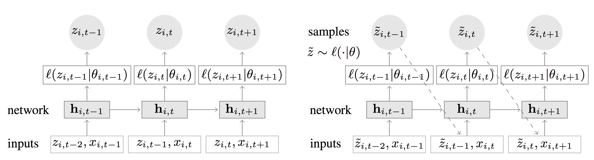
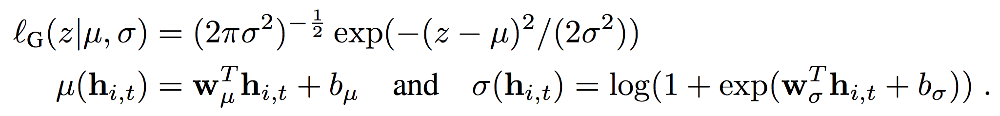
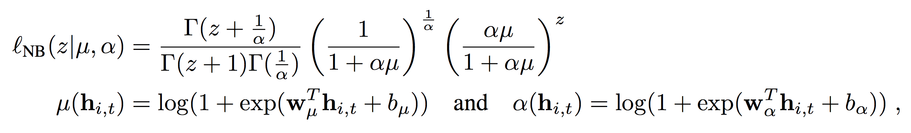
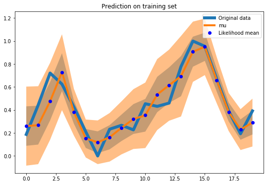
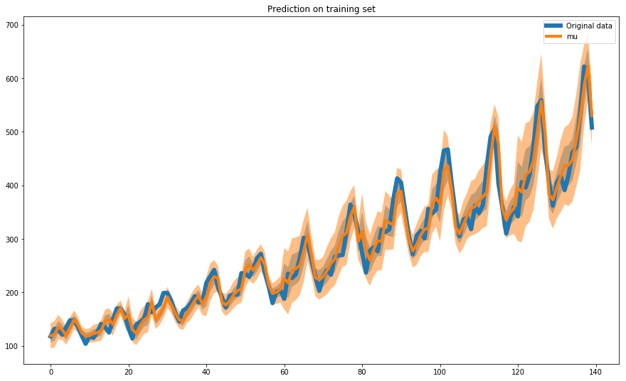

# Paper review & code: Amazon DeepAR
## DeepAR: Probabilistic Forecasting with Autoregressive Recurrent Networks

This blog post is about the DeepAR tool for demand forecasting, which has been released by Amazon last summer and integrated into SageMaker. 
As such, you can use DeepAR directly in Sagemaker (which runs as a black box). Instead, in this blog post I will try to present the theory and the challenges behind it, which are summarized in the paper mentioned in the title.

Needless to say, demand forecasting is challenging, and it is especially difficult when predictions must be run at scale. 
Before I dive into the Amazon model, I try to briefly summarize the critical points I have been facing when dealing with demand forecasting:
- The "scale" problem: "*a lot*" of time series (in case you have been working at a company that has hundreds of product releases every year)
- A "grouped/clustered" structure of released products: categorical variables defining products' characteristics (e.g. product category, sales channel) 
- Cold-start products: products for which we do not have an historical time series (but we may have product category and other types of "shared" characteristics)
- Relevant co-variates: e.g. the weather, time of the year encodings, prices etc...

There are many strategies to solve these problems (some of them are mentioned in the paper, 
such as matrix factorization methods [Yu et al.] and Bayesian approaches with hierarchical priors [Chapados et al.]), but none of them is easily scalable and handles *all* the problems listed above.

### The model

What the authors suggest instead of fitting separate models for each time series is to create a *global* model from related time series to handle widely-varying scales through rescaling and velocity-based sampling.
They use an RNN architecture which incorporates a Gaussian/Negative Binomial likelihood to produce probabilistic forecasting and outperforms traditional single-item forecasting (the authors demonstrate this on several real-world data sets).
The figure below reports the architecture they use for training/prediction:



**Fig. 1 (left)**:
The idea behind this architecture is straightforward: the goal here is to predict at each time step the following (horizon=1). 
This means that the network must receive in input the previous observation (at lag=1) z_t-1, along with a set of (optional covariates x_i). The information is propagated to the hidden layer (represented in figure 1 by h)
and up to the likelihood function (which is a score function used here *in lieau* of a loss function). The likelihood function can be Gaussian or Negative Binomial, but
I will talk more on this later. As you can see in fig.1, during training (the network on the left) the error is calculated using the current parametrization of the likelihood *theta*.
Easily enough, this is represented by `mu` and `sigma` in the case of a Gaussian likelihood. This means that while performing backprop we are tuning the network
parameters (weights `w`) which change the parametrization of every e.g. Gaussian likelihood, until we converge to optimal values.

**Fig 2 (right)**:
Once we have trained the network weights, we can perform forward propagation using input z_i-1 (along with [optional] covariates or one-hot-encoded categorical features) and obtain distribution parameters mu and sigma.
It is now time to predict the future: just remember that the prediction we have at each time step is a distribution, not a single value.
We start by drawing one sample from the output distribution of the first time step: that sample is the input to the second time step and 
so on. Every time we start from the beginning and sample up to the prediction horizon we create the equivalent of Monte Carlo trace, which
means that in the end we can calculate e.g. quantiles of the output distribution or assess uncertainty of the predictions.

We now turn to the likelihood model, which can be both Gaussian (with parametrization mu and sigma):



or negative binomial (when dealing with counts data). In case you have never used this kind of model, just think of it as an extension of a Poisson GLM
where we need to model the variance too (in Poisson models the mean is assumed to be equal to the variance, although when this is not the case we need some extra help to model "overdispersion"):



The bottom line here is that the network is estimating the parameters of the likelihood through a custom layer which returns a list of *theta*.

## About the covariates (features)

Features (x_i in paper notation and fig.1) can be used to provide additional information about the item or the time point (e.g. week of year) to the model.
They can also be used to include covariates that one expects to influence the outcome (e.g. price or promotion
status in the demand forecasting setting), as long as the features’ values are available also in the
prediction range.

## ...and now some code

Let us now turn to some code to implement the basics of DeepAR using Tensorflow. Let us start from the likelihood function 
(I am reporting here only the Gaussian, although it is straightforward to implement the Negative Binomial using the formula above):

```python
import tensorflow as tf

def gaussian_likelihood(sigma):
    def gaussian_loss(y_true, y_pred):
        return tf.reduce_mean(0.5*tf.log(sigma) + 0.5*tf.div(tf.square(y_true - y_pred), sigma)) + 1e-6 + 6
    return gaussian_loss
```

And this is the GaussianLayer we need to output *mu* and *sigma* at every training step (which I have already used in [this blog post](https://arrigonialberto86.github.io/funtime/deep_ensembles.html)):

```python
from keras import backend as K
from keras.initializers import glorot_normal
from keras.layers import Layer


class GaussianLayer(Layer):
    def __init__(self, output_dim, **kwargs):
        self.output_dim = output_dim
        self.kernel_1, self.kernel_2, self.bias_1, self.bias_2 = [], [], [], []
        super(GaussianLayer, self).__init__(**kwargs)

    def build(self, input_shape):
        n_weight_rows = input_shape[2]
        self.kernel_1 = self.add_weight(name='kernel_1',
                                        shape=(n_weight_rows, self.output_dim),
                                        initializer=glorot_normal(),
                                        trainable=True)
        self.kernel_2 = self.add_weight(name='kernel_2',
                                        shape=(n_weight_rows, self.output_dim),
                                        initializer=glorot_normal(),
                                        trainable=True)
        self.bias_1 = self.add_weight(name='bias_1',
                                      shape=(self.output_dim,),
                                      initializer=glorot_normal(),
                                      trainable=True)
        self.bias_2 = self.add_weight(name='bias_2',
                                      shape=(self.output_dim,),
                                      initializer=glorot_normal(),
                                      trainable=True)
        super(GaussianLayer, self).build(input_shape)

    def call(self, x):
        output_mu = K.dot(x, self.kernel_1) + self.bias_1
        output_sig = K.dot(x, self.kernel_2) + self.bias_2
        output_sig_pos = K.log(1 + K.exp(output_sig)) + 1e-06
        return [output_mu, output_sig_pos]

    def compute_output_shape(self, input_shape):
        """
        The assumption is the output ts is always one-dimensional
        """
        return [(input_shape[0], self.output_dim), (input_shape[0], self.output_dim)]
```

And here I have packaged the network structure (which is itself a parameter with a default) with a training (fit) method. In case you are wondering where the deepar package 
referenced below comes from you can find it [here](https://github.com/arrigonialberto86/deepar/blob/master/deepar/model/lstm.py), 
where I stored the prototypical code I used in this blog post:

```python
from deepar.model import NNModel
from deepar.model.layers import GaussianLayer
from keras.layers import Input, Dense, Input
from keras.models import Model
from keras.layers import LSTM
from keras import backend as K
import logging
from deepar.model.loss import gaussian_likelihood

logger = logging.getLogger('deepar')


class DeepAR(NNModel):
    def __init__(self, ts_obj, steps_per_epoch=50, epochs=100, loss=gaussian_likelihood,
                 optimizer='adam', with_custom_nn_structure=None):

        self.ts_obj = ts_obj
        self.inputs, self.z_sample = None, None
        self.steps_per_epoch = steps_per_epoch
        self.epochs = epochs
        self.loss = loss
        self.optimizer = optimizer
        self.keras_model = None
        if with_custom_nn_structure:
            self.nn_structure = with_custom_nn_structure
        else:
            self.nn_structure = DeepAR.basic_structure
        self._output_layer_name = 'main_output'
        self.get_intermediate = None

    @staticmethod
    def basic_structure():
        """
        This is the method that needs to be patched when changing NN structure
        :return: inputs_shape (tuple), inputs (Tensor), [loc, scale] (a list of theta parameters
        of the target likelihood)
        """
        input_shape = (20, 1)
        inputs = Input(shape=input_shape)
        x = LSTM(4, return_sequences=True)(inputs)
        x = Dense(3, activation='relu')(x)
        loc, scale = GaussianLayer(1, name='main_output')(x)
        return input_shape, inputs, [loc, scale]

    def instantiate_and_fit(self, verbose=False):
        input_shape, inputs, theta = self.nn_structure()
        model = Model(inputs, theta[0])
        model.compile(loss=self.loss(theta[1]), optimizer=self.optimizer)
        model.fit_generator(ts_generator(self.ts_obj,
                                         input_shape[0]),
                            steps_per_epoch=self.steps_per_epoch,
                            epochs=self.epochs)
        if verbose:
            logger.debug('Model was successfully trained')
        self.keras_model = model
        self.get_intermediate = K.function(inputs=[self.model.input],
                                           outputs=self.model.get_layer(self._output_layer_name).output)

    @property
    def model(self):
        return self.keras_model

    def predict_theta_from_input(self, input_list):
        """
        This function takes an input of size equal to the n_steps specified in 'Input' when building the
        network
        :param input_list:
        :return: [[]], a list of list. E.g. when using Gaussian layer this returns a list of two list,
        corresponding to [[mu_values], [sigma_values]]
        """
        if not self.get_intermediate:
            raise ValueError('TF model must be trained first!')

        return self.get_intermediate(input_list)


def ts_generator(ts_obj, n_steps):
    """
    This is a util generator function for Keras
    :param ts_obj: a Dataset child class object that implements the 'next_batch' method
    :param n_steps: parameter that specifies the length of the net's input tensor
    :return:
    """
    while 1:
        batch = ts_obj.next_batch(1, n_steps)
        yield batch[0], batch[1]

```

This is all we need for the model: we have a custom "Gaussian" layer and an object handling the training + (custom) prediction of the network. 
We now need a `TimeSeries` object to incapsulate the dataset and return batches of data to the generator. `TimeSeries` is a subclass of the Dataset abstract
class which simply implements the `next_batch` method.

```python
from deepar.dataset import Dataset
import numpy as np
import pandas as pd


class TimeSeries(Dataset):
    def __init__(self, pandas_df, one_hot_root_list=None, grouping_variable='category', scaler=None):
        super().__init__()
        self.data = pandas_df
        self.one_hot_root_list = one_hot_root_list
        self.grouping_variable = grouping_variable
        if self.data is None:
            raise ValueError('Must provide a Pandas df to instantiate this class')
        self.scaler = scaler

    def _one_hot_padding(self, pandas_df, padding_df):
        """
        Util padding function
        :param padding_df:
        :param one_hot_root_list:
        :return:
        """
        for one_hot_root in self.one_hot_root_list:
            one_hot_columns = [i for i in pandas_df.columns   # select columns equal to 1
                               if i.startswith(one_hot_root) and pandas_df[i].values[0] == 1]
            for col in one_hot_columns:
                padding_df[col] = 1
        return padding_df

    def _pad_ts(self, pandas_df, desired_len, padding_val=0):
        """
        Add padding int to the time series
        :param pandas_df:
        :param desired_len: (int)
        :param padding_val: (int)
        :return: X (feature_space), y
        """
        pad_length = desired_len - pandas_df.shape[0]
        padding_df = pd.concat([pd.DataFrame({col: padding_val for col in pandas_df.columns},
                                             index=[i for i in range(pad_length)])])

        if self.one_hot_root_list:
            padding_df = self._one_hot_padding(pandas_df, padding_df)

        return pd.concat([padding_df, pandas_df]).reset_index(drop=True)

    @staticmethod
    def _sample_ts(pandas_df, desired_len):
        """
        :param pandas_df: input pandas df with 'target' columns e features
        :param desired_len: desired sample length (number of rows)
        :param padding_val: default is 0
        :param initial_obs: how many observations to skip at the beginning
        :return: a pandas df (sample)
        """
        if pandas_df.shape[0] < desired_len:
            raise ValueError('Desired sample length is greater than df row len')
        if pandas_df.shape[0] == desired_len:
            return pandas_df

        start_index = np.random.choice([i for i in range(0, pandas_df.shape[0] - desired_len + 1)])
        return pandas_df.iloc[start_index: start_index+desired_len, ]

    def next_batch(self, batch_size, n_steps,
                   target_var='target', verbose=False,
                   padding_value=0):
        """
        :param batch_size: how many time series to be sampled in this batch (int)
        :param n_steps: how many RNN cells (int)
        :param target_var: (str)
        :param verbose: (boolean)
        :param padding_value: (float)
        :return: X (feature space), y
        """

        # Select n_batch time series
        groups_list = self.data[self.grouping_variable].unique()
        np.random.shuffle(groups_list)
        selected_groups = groups_list[:batch_size]
        input_data = self.data[self.data[self.grouping_variable].isin(set(selected_groups))]

        # Initial padding for each selected time series to reach n_steps
        sampled = []
        for cat, cat_data in input_data.groupby(self.grouping_variable):
                if cat_data.shape[0] < n_steps:
                    sampled_cat_data = self._pad_ts(pandas_df=cat_data,
                                                    desired_len=n_steps,
                                                    padding_val=padding_value)
                else:
                    sampled_cat_data = self._sample_ts(pandas_df=cat_data,
                                                       desired_len=n_steps)
                sampled.append(sampled_cat_data)
        rnn_output = pd.concat(sampled).drop(columns=self.grouping_variable).reset_index(drop=True)

        if self.scaler:
            batch_scaler = self.scaler()
            n_rows = rnn_output.shape[0]
            # Scaling must be extended to handle multivariate time series!
            rnn_output['feature_1'] = rnn_output.feature_1.astype('float')
            rnn_output[target_var] = rnn_output[target_var].astype('float')

            rnn_output['feature_1'] = batch_scaler.fit_transform(rnn_output.feature_1.values.reshape(n_rows, 1)).reshape(n_rows)
            rnn_output[target_var] = batch_scaler.fit_transform(rnn_output[target_var].values.reshape(n_rows, 1)).reshape(n_rows)

        return rnn_output.drop(target_var, 1).as_matrix().reshape(batch_size, n_steps, -1), \
               rnn_output[target_var].as_matrix().reshape(batch_size, n_steps, 1)
```

## The mandatory AirPassengers example

Now that we have an API to hold our dataset and train our custom Keras model, we just need an example to show that we can make this work.
The example I have chosen is of course not a perfect fit for two reasons: 1) DeepAR shines when dealing with multiple (possibly inter-related time series)
2) this is a univariate time series, although I said before that the power of this algorithm lies in "features" treatment and covariates.
Despite this, we go ahead and load the (in)famous dataset:

```python
import pandas as pd

air = pd.read_csv("AirPassengers.csv")['#Passengers'].values
source_df = pd.DataFrame({'feature_1': air[:-1], 'target': air[1:]})
source_df['category'] = ['1' for i in range(source_df.shape[0])]
```

In order to comply with the TimeSeries API for batches generation, we add a `category` column that tells the model that we only have one time series here.
Then, we just use the default network structure (which we have defined in the `basic_structure` method above) to train our model on the data.
The sampling scheme reported in the default network architecture uses 20 points (i.e. the network's input shape is 20), so that the model model can learn the
correlation in this time frame between subsequent observations. We scale the 20-points batches using the `MinMaxScaler` so that we avoid handling scale difference 
between batches.


```python
from deepar.dataset.time_series import TimeSeries
from deepar.model.lstm import DeepAR
from sklearn.preprocessing import MinMaxScaler

ts = TimeSeries(source_df, scaler=MinMaxScaler)
dp_model = DeepAR(ts, epochs=100)
dp_model.instantiate_and_fit()
```

Now that we have a model trained on the whole time series we can sample a random batch from training data and evaluate the fit.
What we need to do is to sample from the output joint distribution multiple times (the Monte Carlo traces I have mentioned before).
The function `get_sample_prediction` samples from a Gaussian distribution parametrized by `mu` and `sigma` predicted by the LSTM network.

```python
%matplotlib inline
from numpy.random import normal
import tqdm
import pandas as pd
from matplotlib import pyplot as plt
import numpy as np

batch = ts.next_batch(1, 20)

def get_sample_prediction(sample, prediction_fn):
    sample = np.array(sample).reshape(1, 20, 1)
    output = prediction_fn([sample])
    samples = []
    for mu,sigma in zip(output[0].reshape(20), output[1].reshape(20)):
        samples.append(normal(loc=mu, scale=np.sqrt(sigma), size=1)[0])
    return np.array(samples)

ress = []
for i in tqdm.tqdm(range(300)):
    pred = get_sample_prediction(batch[0], dp_model.predict_theta_from_input)
    ress.append(pred)

def plot_uncertainty(ress, ground_truth, n_steps=20, figsize=(9, 6), 
                     prediction_dots=True, title='Prediction on training set'):
    
    res_df = pd.DataFrame(ress).T
    tot_res = res_df

    plt.figure(figsize=figsize)
    plt.plot(ground_truth.reshape(n_steps), linewidth=6, label='Original data')
    tot_res['mu'] = tot_res.apply(lambda x: np.mean(x), axis=1)
    tot_res['upper'] = tot_res.apply(lambda x: np.mean(x) + np.std(x), axis=1)
    tot_res['lower'] = tot_res.apply(lambda x: np.mean(x) - np.std(x), axis=1)
    tot_res['two_upper'] = tot_res.apply(lambda x: np.mean(x) + 2*np.std(x), axis=1)
    tot_res['two_lower'] = tot_res.apply(lambda x: np.mean(x) - 2*np.std(x), axis=1)

    plt.plot(tot_res.mu, linewidth=4)
    if prediction_dots:
        plt.plot(tot_res.mu, 'bo', label='Likelihood mean')
    plt.fill_between(x = tot_res.index, y1=tot_res.lower, y2=tot_res.upper, alpha=0.5)
    plt.fill_between(x = tot_res.index, y1=tot_res.two_lower, y2=tot_res.two_upper, alpha=0.5)
    plt.title(title)
    plt.legend()
    
plot_uncertainty(ress, batch[1])
```



In a similar way we evaluate the training fit on the whole time series:

```python
# Evaluate fit on training set
from sklearn.preprocessing import MinMaxScaler

source_df['feature_1'] = source_df.feature_1.astype('float')
X_batches = source_df.feature_1.values[:-3].reshape(-1, 20)
y = source_df.target.values[:-3].reshape(-1, 20)

predictions = []
for batch in X_batches:
    scaler = MinMaxScaler()
    scaled_batch = scaler.fit_transform(batch.reshape(20, 1))
    ress = []
    for i in tqdm.tqdm(range(300)):
        unscaled_prediction = get_sample_prediction(scaled_batch, dp_model.predict_theta_from_input)
        ress.append(scaler.inverse_transform([unscaled_prediction])[0])
    predictions.append(ress)

# Concatenate batches and plot the whole time series
prediction_concat = np.concatenate(predictions, axis=1, )
ground_truth = np.concatenate(y, axis=0)
plot_uncertainty(ress = prediction_concat, ground_truth=ground_truth, 
                 n_steps=140, figsize=(15, 9), prediction_dots=False)
```

