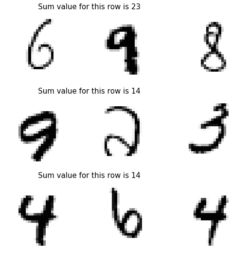

# Paper review & code: Deep Sets
## Deep Sets, NIPS 

This is a long overdue piece on a paper I read last year and found to be very interesting, practical and super easy to implement. 
It suggests a relatively simple way to structure deep nets in order to handle *sets* instead of ordered *lists* of elements.
Despite this unimpressive description, it has important practical applications and surely its range of applicability goes far
beyond what I thought of when I read it for the first time.

Sets in data are everywhere, and the class of models I will describe in the present post are set to attain *permutation invariance*
of the inputs. An intuitive explanation of what a permutation invariant function is a function for which this relationship holds true:


In the **supervised** setting modeling sets is relevant when dealing with mappings to a label that should be invariant to inputs ordering
e.g. sets of objects in a scene, multi-agent reinforcement learning, estimation of population statistics...
In the **unsupervised** setting sets are relevant to tasks such as set/audience expansion, where given a set of objects that are similar to 
each other (e.g. set of words {lion, tiger, leopard}), our goal is to find new objects from a large pool of candidates such that 
the selected new objects are similar to the query (Zaheer et al., 2018).

Using the same notation of the DeepSets paper (Zaheer et al. 2018) a function operating on a input X is a valid set function 
(i.e. **invariant** to the permutation of instances in X) iff it can be decomposed in the form 

The two "sub"-functions  and
 are parameterized by neural networks, and by this 
simple formula you can tell that there is a shared branch of the net (defined by )
which processes set elements independently, which are later *pooled* by .
You can picture this process as well by regarding these two functions as `map` ops followed by `reduce`.

## The architecture

Let me now list the required architectural elements that compose a DeepSet neural network:
- Each input element of the set if transformed (possibily by several layers) of the 'mapping' function 
- The resulting vectors are summed up and the output is in turn transformed by using the 
network (the same as any other feed-forward neural network).
- An optional 'branch' of the neural network may be used to encode additional contextual information  related to the entire set.
This effectively models the conditioning mapping 

## De Finetti's theorem and the basis of exchangeability
 
The concept of permutation invariance is intimately connected with the concept of exchangeability in Bayesian statistics,
whose cornerstone is represented by the De Finetti theorem. 
This theorem states that exchangeable observations (i.e. members of a set) are conditionally independent relative to some
latent variable (). The formula is very clear in this regard:


In order to show how this formulation relates to the definition reported above of a *permutation-invariant* function, Zaheer et al.
consider exponential families with conjugate priors (so that we can analytically calculate the integral).
In this case the prior distribution is defined as:


and the likelihood as:


It is now possible to marginalize out the latent variable 
and observe the resulting functional form, which looks exactly as the one listed above when defining the structure of our
*permutation invariant* neural network:


## The code

Let us now implement a simple experiment that is also reported in the original **Deep Sets** publication. A neural network 
receives in input a set of MNIST images (28 x 28 pixels) and needs to compute their numerical sum. In this experiment, the model
is trained end-to-end in order to interpret the identity of the numbers in input image and to produce their sum after aggregation (*pooling*). 
The number of images to be used (the input set) is itself a variable, in this simple example though, it will be restricted to 3.

The structure of the neural net consists of an *image-processing* part which condense the information contained in the input image
(as usual through subsequent convolutional layers) and a feed-forward neural net after pooling (the *sum* operation) which transforms
the vector into the output number.
Let us start by sourcing the data from with `tf` APIs:

```python
import tensorflow as tf
(x_train, y_train), (x_test, y_test) = tf.keras.datasets.mnist.load_data()
```

Next, we create a suitable form for the input training/test set by sampling random triplets of numbers and computing their sum:

```python
import numpy as np
from typing import List, Tuple
from tqdm import tqdm_notebook as tqdm

def extract_image_set(x_data: np.array, y_data :np.array, agg_fun=np.sum, n_images=3) -> Tuple[np.array, np.array]:
  """
  Extract a single set of images with corresponding target
  :param x_data
  """
  idxs = np.random.randint(low=0, high=len(x_data)-1, size=n_images)
  return x_data[idxs], agg_fun(y_data[idxs])


def generate_dataset(n_samples: int, x_data: np.array, y_data :np.array, agg_fun=np.sum, n_images=3) -> Tuple[List[List[np.array]], np.array]:
  """
  :return X,y in format suitable for training/prediction 
  """
  generated_list = [extract_image_set(x_data, y_data, agg_fun, n_images) for i in tqdm(range(n_samples))]
  X, y = [i[0] for i in generated_list], np.array([t[1] for t in generated_list])
  output_lists = [[] for i in range(n_images)]
  for image_idx in range(n_images):
    for sample_idx in range(n_samples):
      output_lists[image_idx].append(np.expand_dims(X[sample_idx][image_idx], axis=2))
  return output_lists, y

X_train_data, y_train_data = generate_dataset(n_samples=100000, x_data=x_train, y_data=y_train, n_images=3)
X_test_data, y_test_data = generate_dataset(n_samples=20000, x_data=x_test, y_data=y_test, n_images=3)
```

And just to have an idea of what the dataset looks like we can visualize it like this:

```python
import matplotlib.pyplot as plt
%matplotlib inline 

n_sample_viz, n_images = 3, 3

fig, axes = plt.subplots(nrows=n_sample_viz, ncols=n_images, figsize=(9.0, 9.0))

for sample_idx in range(n_sample_viz):
  for im_idx in range(n_images):
    axes[sample_idx, im_idx].imshow(X_train_data[im_idx][sample_idx][:, :, 0], cmap='Greys')
    axes[sample_idx, im_idx].axis('off')
    if im_idx==0:
      axes[sample_idx, 0].set_title('               Sum value for this row is {}'.format(y_train_data[sample_idx]), 
                                    fontsize=15, loc='left')
```



And now the network structure. In this simple example notice in particular the shared portion of the model (named `feature_ext_model`)
which processes in parallel the input images. The *pooling* operation in this model is the `Add` function that simply sums the values taken by 
the output vectors.

```python
from tensorflow.keras.layers import Dense
from tensorflow.keras.layers import Input
from tensorflow.keras.models import Model
from tensorflow.keras.layers import Conv2D
from tensorflow.keras.layers import MaxPooling2D
from tensorflow.keras.layers import Flatten
from tensorflow.keras.layers import Dropout
from tensorflow.keras.layers import Add
from tensorflow.keras.optimizers import Adam

import os, datetime

input_shape = (28, 28, 1)
filters = 64
kernel_size = 3

# Shared portion of the network
input_image = Input(shape=input_shape)

y = Conv2D(32, kernel_size=(3, 3),
           activation='relu',
           input_shape=input_shape)(input_image)
y = Conv2D(64, (3, 3), activation='relu')(y)
y = MaxPooling2D(pool_size=(2, 2))(y)
y = Dropout(0.25)(y)
y = Flatten()(y)
output_vec = Dense(128, activation='relu')(y)

feature_ext_model = Model(input_image, output_vec)

image_1, image_2, image_3 = Input(shape=input_shape), Input(shape=input_shape), \
                            Input(shape=input_shape)
outputs_1, outputs_2, outputs_3 = feature_ext_model(image_1), feature_ext_model(image_2), feature_ext_model(image_3)

y = Add()([outputs_1, outputs_2, outputs_3])
y = Dense(64, activation='relu')(y)
y = Dense(32, activation='relu')(y)
encoded = Dense(1)(y)

model = Model([image_1, image_2, image_3], encoded)
adam = Adam()
model.compile(optimizer=adam, loss='mae')

logdir = os.path.join("logs", datetime.datetime.now().strftime("%Y%m%d-%H%M%S"))
tensorboard_callback = tf.keras.callbacks.TensorBoard(logdir, histogram_freq=1)

model.fit(x=X_train_data, y=y_train_data,
          epochs=10, batch_size=64)
```

The trained model can now be used for prediction and we can visualize some random samples:

```python
prediction = model.predict(x=X_test_data)

import matplotlib.pyplot as plt
%matplotlib inline 

n_sample_viz, n_images = 4, 3

fig, axes = plt.subplots(nrows=n_sample_viz, ncols=n_images, figsize=(12.0, 12.0))
for sample_idx in range(n_sample_viz):
  for im_idx in range(n_images):
    axes[sample_idx, im_idx].imshow(X_test_data[im_idx][sample_idx][:, :, 0], cmap='Greys')
    axes[sample_idx, im_idx].axis('off')
    if im_idx==0:
      axes[sample_idx, 0].set_title('Sum value for this row is {}, prediction is {}'.format(y_test_data[sample_idx], round(prediction[sample_idx][0])), 
                                    fontsize=15, loc='left')
```


## Reference
- https://www.inference.vc/deepsets-modeling-permutation-invariance/
- https://arxiv.org/pdf/1703.06114.pdf

## Equation editor
- https://www.codecogs.com/latex/eqneditor.php (Latin Modern, 12pts, 150 dpi)