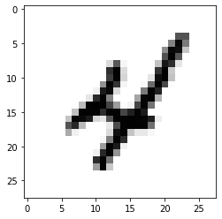

```python
import tensorflow as tf
(x_train, y_train), (x_test, y_test) = tf.keras.datasets.mnist.load_data()
```


<p style="color: red;">
The default version of TensorFlow in Colab will soon switch to TensorFlow 2.x.<br>
We recommend you <a href="https://www.tensorflow.org/guide/migrate" target="_blank">upgrade</a> now 
or ensure your notebook will continue to use TensorFlow 1.x via the <code>%tensorflow_version 1.x</code> magic:
<a href="https://colab.research.google.com/notebooks/tensorflow_version.ipynb" target="_blank">more info</a>.</p>


    Downloading data from https://storage.googleapis.com/tensorflow/tf-keras-datasets/mnist.npz
    11493376/11490434 [==============================] - 0s 0us/step


>$e^x=\sum_{i=0}^\infty \frac{1}{i!}x^i$


```python
import numpy as np

dataset_x = np.vstack([x_train, x_test])
dataset_y = np.concatenate([y_train, y_test])
```


```python
import matplotlib.pyplot as plt
%matplotlib inline 
image_index = 9 
print(y_train[image_index])
plt.imshow(dataset_x[image_index], cmap='Greys')
```

    4


    <matplotlib.image.AxesImage at 0x7fb604db1ba8>





```python
from tqdm import tqdm_notebook
def convert_and_reshape(alist):
    alist = np.array(alist)
    alist = alist.reshape(alist.shape[0], 28, 28, 1)
    return alist


first_list, second_list, third_list, target = [], [], [], []
for r in tqdm_notebook(range(6000)):
    idxs = np.random.randint(dataset_x.shape[0], size=3)
    first_list.append(dataset_x[idxs[0]])
    second_list.append(dataset_x[idxs[1]])
    third_list.append(dataset_x[idxs[2]])
    target.append(dataset_y[idxs].sum())

first_list = convert_and_reshape(first_list)
second_list = convert_and_reshape(second_list)
third_list = convert_and_reshape(third_list)
target = np.array(target)
```


    HBox(children=(IntProgress(value=0, max=6000), HTML(value='')))


    


```python
from keras.layers.core import Dense
from keras.layers import Input
from keras.models import Model
from keras.layers import Conv2D
from keras.layers import MaxPooling2D
from keras.layers import Flatten
from keras.layers import Dropout
from keras.layers import Add
from keras.optimizers import Adam

input_shape = (28, 28, 1)
filters = 64
kernel_size = 3

# First input
inputs_1 = Input(shape=input_shape)
y = Conv2D(filters=filters,
           kernel_size=kernel_size,
           activation='relu')(inputs_1)
y = MaxPooling2D()(y)
y = Conv2D(filters=filters,
           kernel_size=kernel_size,
           activation='relu')(y)
y = MaxPooling2D()(y)
y = Conv2D(filters=filters,
           kernel_size=kernel_size,
           activation='relu')(y)
# image to vector before connecting to dense layer
y = Flatten()(y)
y = Dropout(rate=0.3)(y)
outputs_1 = Dense(30)(y)

# Third input
inputs_2 = Input(shape=input_shape)
y = Conv2D(filters=filters,
           kernel_size=kernel_size,
           activation='relu')(inputs_2)
y = MaxPooling2D()(y)
y = Conv2D(filters=filters,
           kernel_size=kernel_size,
           activation='relu')(y)
y = MaxPooling2D()(y)
y = Conv2D(filters=filters,
           kernel_size=kernel_size,
           activation='relu')(y)
# image to vector before connecting to dense layer
y = Flatten()(y)
y = Dropout(rate=0.3)(y)
outputs_2 = Dense(30)(y)

# First input
inputs_3 = Input(shape=input_shape)
y = Conv2D(filters=filters,
           kernel_size=kernel_size,
           activation='relu')(inputs_3)
y = MaxPooling2D()(y)
y = Conv2D(filters=filters,
           kernel_size=kernel_size,
           activation='relu')(y)
y = MaxPooling2D()(y)
y = Conv2D(filters=filters,
           kernel_size=kernel_size,
           activation='relu')(y)
# image to vector before connecting to dense layer
y = Flatten()(y)
y = Dropout(rate=0.3)(y)
outputs_3 = Dense(30)(y)

y = Add()([outputs_1, outputs_2, outputs_3])
y = Dense(30)(y)
y = Dense(30)(y)
encoded = Dense(1)(y)

model = Model([inputs_1, inputs_2, inputs_3], encoded)
adam = Adam(lr=1e-3, epsilon=1e-3)
model.compile(optimizer=adam, loss='mae')
```

    WARNING:tensorflow:From /usr/local/lib/python3.6/dist-packages/keras/backend/tensorflow_backend.py:66: The name tf.get_default_graph is deprecated. Please use tf.compat.v1.get_default_graph instead.
    
    WARNING:tensorflow:From /usr/local/lib/python3.6/dist-packages/keras/backend/tensorflow_backend.py:541: The name tf.placeholder is deprecated. Please use tf.compat.v1.placeholder instead.
    
    WARNING:tensorflow:From /usr/local/lib/python3.6/dist-packages/keras/backend/tensorflow_backend.py:4432: The name tf.random_uniform is deprecated. Please use tf.random.uniform instead.
    
    WARNING:tensorflow:From /usr/local/lib/python3.6/dist-packages/keras/backend/tensorflow_backend.py:4267: The name tf.nn.max_pool is deprecated. Please use tf.nn.max_pool2d instead.
    
    WARNING:tensorflow:From /usr/local/lib/python3.6/dist-packages/keras/backend/tensorflow_backend.py:148: The name tf.placeholder_with_default is deprecated. Please use tf.compat.v1.placeholder_with_default instead.
    
    WARNING:tensorflow:From /usr/local/lib/python3.6/dist-packages/keras/backend/tensorflow_backend.py:3733: calling dropout (from tensorflow.python.ops.nn_ops) with keep_prob is deprecated and will be removed in a future version.
    Instructions for updating:
    Please use `rate` instead of `keep_prob`. Rate should be set to `rate = 1 - keep_prob`.


    Using TensorFlow backend.


    WARNING:tensorflow:From /usr/local/lib/python3.6/dist-packages/keras/optimizers.py:793: The name tf.train.Optimizer is deprecated. Please use tf.compat.v1.train.Optimizer instead.
    


```python
model.fit(
    [first_list, second_list, third_list], target,
    epochs=300, batch_size=8)
```

    WARNING:tensorflow:From /usr/local/lib/python3.6/dist-packages/keras/backend/tensorflow_backend.py:1033: The name tf.assign_add is deprecated. Please use tf.compat.v1.assign_add instead.
    
    WARNING:tensorflow:From /usr/local/lib/python3.6/dist-packages/keras/backend/tensorflow_backend.py:1020: The name tf.assign is deprecated. Please use tf.compat.v1.assign instead.
    
    WARNING:tensorflow:From /usr/local/lib/python3.6/dist-packages/keras/backend/tensorflow_backend.py:3005: The name tf.Session is deprecated. Please use tf.compat.v1.Session instead.
    
    Epoch 1/300
    WARNING:tensorflow:From /usr/local/lib/python3.6/dist-packages/keras/backend/tensorflow_backend.py:190: The name tf.get_default_session is deprecated. Please use tf.compat.v1.get_default_session instead.
    
    WARNING:tensorflow:From /usr/local/lib/python3.6/dist-packages/keras/backend/tensorflow_backend.py:197: The name tf.ConfigProto is deprecated. Please use tf.compat.v1.ConfigProto instead.
    
    WARNING:tensorflow:From /usr/local/lib/python3.6/dist-packages/keras/backend/tensorflow_backend.py:207: The name tf.global_variables is deprecated. Please use tf.compat.v1.global_variables instead.
    
    WARNING:tensorflow:From /usr/local/lib/python3.6/dist-packages/keras/backend/tensorflow_backend.py:216: The name tf.is_variable_initialized is deprecated. Please use tf.compat.v1.is_variable_initialized instead.
    
    WARNING:tensorflow:From /usr/local/lib/python3.6/dist-packages/keras/backend/tensorflow_backend.py:223: The name tf.variables_initializer is deprecated. Please use tf.compat.v1.variables_initializer instead.
    
    6000/6000 [==============================] - 32s 5ms/step - loss: 4.7378
    Epoch 2/300
    6000/6000 [==============================] - 30s 5ms/step - loss: 2.9165
    Epoch 3/300
    6000/6000 [==============================] - 31s 5ms/step - loss: 2.6114
    Epoch 4/300
    6000/6000 [==============================] - 31s 5ms/step - loss: 2.3633
    Epoch 5/300
    6000/6000 [==============================] - 31s 5ms/step - loss: 2.2698
    Epoch 6/300
    6000/6000 [==============================] - 30s 5ms/step - loss: 2.2271
    Epoch 7/300
    6000/6000 [==============================] - 31s 5ms/step - loss: 2.1257
    Epoch 8/300
    6000/6000 [==============================] - 29s 5ms/step - loss: 2.0592
    Epoch 9/300
    6000/6000 [==============================] - 30s 5ms/step - loss: 2.0424
    Epoch 10/300
    6000/6000 [==============================] - 30s 5ms/step - loss: 1.9361
    Epoch 11/300
    6000/6000 [==============================] - 31s 5ms/step - loss: 1.9054
    Epoch 12/300
    4560/6000 [=====================>........] - ETA: 7s - loss: 1.8441


    ---------------------------------------------------------------------------

    KeyboardInterrupt                         Traceback (most recent call last)

    <ipython-input-6-4abb77a9897e> in <module>()
          1 model.fit(
          2     [first_list, second_list, third_list], target,
    ----> 3     epochs=300, batch_size=8)
    

    /usr/local/lib/python3.6/dist-packages/keras/engine/training.py in fit(self, x, y, batch_size, epochs, verbose, callbacks, validation_split, validation_data, shuffle, class_weight, sample_weight, initial_epoch, steps_per_epoch, validation_steps, validation_freq, max_queue_size, workers, use_multiprocessing, **kwargs)
       1176                                         steps_per_epoch=steps_per_epoch,
       1177                                         validation_steps=validation_steps,
    -> 1178                                         validation_freq=validation_freq)
       1179 
       1180     def evaluate(self,


    /usr/local/lib/python3.6/dist-packages/keras/engine/training_arrays.py in fit_loop(model, fit_function, fit_inputs, out_labels, batch_size, epochs, verbose, callbacks, val_function, val_inputs, shuffle, callback_metrics, initial_epoch, steps_per_epoch, validation_steps, validation_freq)
        202                     ins_batch[i] = ins_batch[i].toarray()
        203 
    --> 204                 outs = fit_function(ins_batch)
        205                 outs = to_list(outs)
        206                 for l, o in zip(out_labels, outs):


    /usr/local/lib/python3.6/dist-packages/keras/backend/tensorflow_backend.py in __call__(self, inputs)
       2977                     return self._legacy_call(inputs)
       2978 
    -> 2979             return self._call(inputs)
       2980         else:
       2981             if py_any(is_tensor(x) for x in inputs):


    /usr/local/lib/python3.6/dist-packages/keras/backend/tensorflow_backend.py in _call(self, inputs)
       2935             fetched = self._callable_fn(*array_vals, run_metadata=self.run_metadata)
       2936         else:
    -> 2937             fetched = self._callable_fn(*array_vals)
       2938         return fetched[:len(self.outputs)]
       2939 


    /usr/local/lib/python3.6/dist-packages/tensorflow_core/python/client/session.py in __call__(self, *args, **kwargs)
       1470         ret = tf_session.TF_SessionRunCallable(self._session._session,
       1471                                                self._handle, args,
    -> 1472                                                run_metadata_ptr)
       1473         if run_metadata:
       1474           proto_data = tf_session.TF_GetBuffer(run_metadata_ptr)


    KeyboardInterrupt: 


```python
prediction = model.predict([first_list, second_list, third_list])
```


```python
# Save the model
import keras

# model.save('model_september_18th.h5')

# Recreate the exact same model purely from the file
# new_model = keras.models.load_model('model_september_18th.h5')
```


```python
import matplotlib.pyplot as plt
import seaborn as sns
import pandas as pd

results = pd.DataFrame({'Prediction': prediction.reshape(-1), 'Target': target.reshape(-1)})
sns.scatterplot(x = 'Prediction', y = 'Target', data=results)
```


```python
mean_error = round(results.apply(lambda x: abs(x.Prediction - x.Target), axis=1).mean(), 2)
sns.distplot(results.apply(lambda x: abs(x.Prediction - x.Target), axis=1).values)
plt.title('Mean error on training set: {}'.format(mean_error))
```


```python
from pylab import rcParams
rcParams['figure.figsize'] = 12, 9
import numpy as np
from numpy.random import uniform

fig, axs = plt.subplots(1, 3)

idxs_list = uniform(low=0, high=6000, size=3)
idxs_list = [int(i) for i in idxs_list]
pred = model.predict([first_list[idxs_list[0]].reshape(1, 28, 28, 1), 
                      second_list[idxs_list[1]].reshape(1, 28, 28, 1), 
                      third_list[idxs_list[2]].reshape(1, 28, 28, 1)])

fig.suptitle('Predicted sum for these numbers is: {}'.format(round(pred[0][0]), 2), size=21)

axs[0].imshow(first_list[idxs_list[0]].reshape(28, 28), cmap='Greys')
axs[1].imshow(second_list[idxs_list[1]].reshape(28, 28), cmap='Greys')
axs[2].imshow(third_list[idxs_list[2]].reshape(28, 28), cmap='Greys')


```


```python
from ipywidgets import widgets
from pylab import rcParams
rcParams['figure.figsize'] = 12, 9
import numpy as np
from numpy.random import uniform
from IPython.display import display

button = widgets.Button(description = 'Sample new triplet')
display(button)

def callback(dummy):
    fig, axs = plt.subplots(1, 3)
    idxs_list = uniform(low=0, high=6000, size=3)
    idxs_list = [int(i) for i in idxs_list]
    pred = model.predict([first_list[idxs_list[0]].reshape(1, 28, 28, 1), 
                          second_list[idxs_list[1]].reshape(1, 28, 28, 1), 
                          third_list[idxs_list[2]].reshape(1, 28, 28, 1)])

    fig.suptitle('Predicted sum for these numbers is: {}'.format(round(pred[0][0]), 2), size=21)

    axs[0].imshow(first_list[idxs_list[0]].reshape(28, 28), cmap='Greys')
    axs[1].imshow(second_list[idxs_list[1]].reshape(28, 28), cmap='Greys')
    axs[2].imshow(third_list[idxs_list[2]].reshape(28, 28), cmap='Greys')

button.on_click(callback)
```


```python

```
