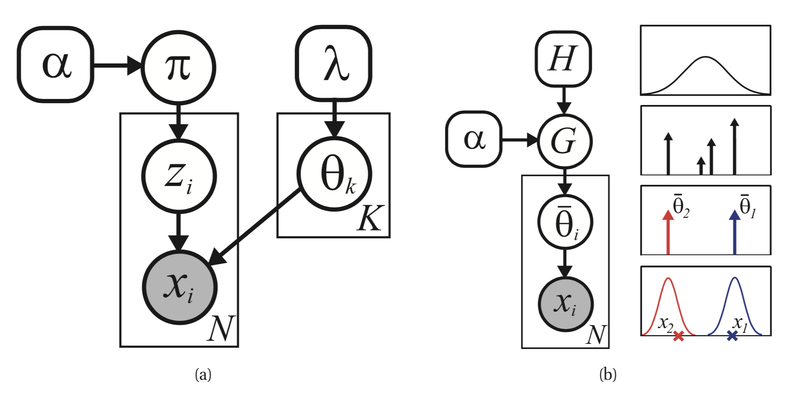
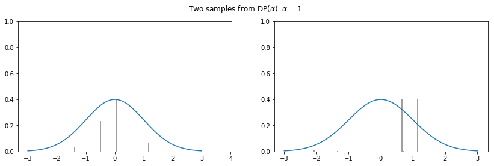
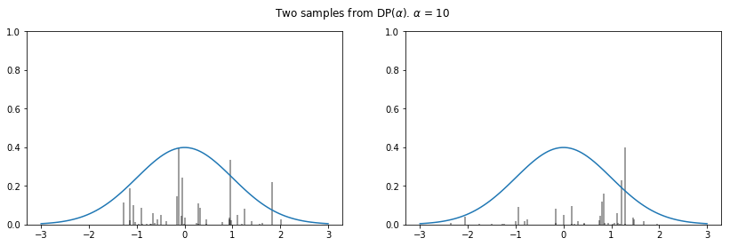
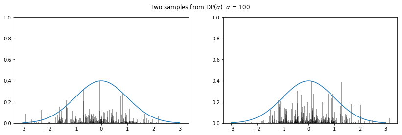
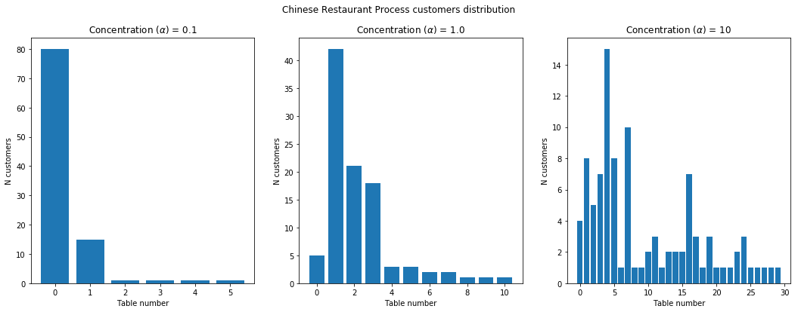
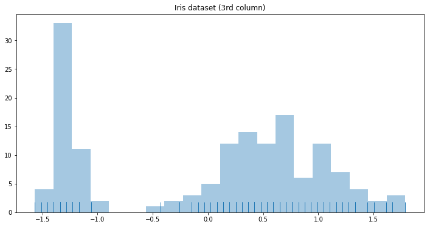
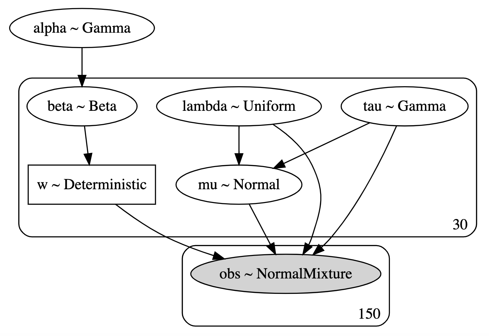

# Dirichlet mixture processes
## Where do people sit in a Chinese restaurant?


## Introduction
I have been wanting to write about Dirichlet processes (DP) for some time now, but I have never had the chance to wrap my mind around this topic which I consider to be truly fascinating.
In particular, I found hard to understand how the famous Chinese restaurant process (CRP) is intimately linked to the abstract concept behind Dirichlet processes (DPs).
This was until I read Chapter 25 of [this](https://www.amazon.com/Machine-Learning-Probabilistic-Perspective-Computation-ebook/dp/B00AF1AYTQ) book, 
where the author shows how the CRP is a natural descendant (or literally the same thing) as a Dirichlet process.

From these, the author shows how DPs are intimately related to clustering, a class of algorithms for which the number of clusters is defined by the process itself and its parametrization. 
In the following paragraphs, I will try to give a concise explanation of DP processes and how they could be used to determine the number of clusters for a simple dataset. 

## Intuition and formal model description
Very simply put, a Dirichlet process is a distribution over distributions, so that instead of generating a single parameter (vector), a single draw from a DP outputs another (discrete) distribution. 
As tricky as it sounds, we can develop some intuition for DP through the following example borrowed from genomics data analysis. Let's say we have a a dozen blood samples of the same person over the course of a treatment: 
for each blood sample we have measurements for about ~30 k genes and we are interested in capturing patterns of co-espressions, i.e. genes whose expression co-vary hinting at shared regulatory processes.
One obvious solution to this is clustering, although it be may hard (if not impossible) to decide a priori what the number of clusters will be (assuming we plan to use a 'space partitioning' algorithm like K-means).
The number of co-expression patterns is not known, moreover clustering itself is used as a tool to identify novel co-regulatory circuits that could be targeted in therapeutic settings. 
By using a Dirichlet process we circumvent the need to specify the number of clusters ahead of time.

Let's naively start modeling our dataset by supposing that there are K clusters of normally distributed expression patterns (as in microarray experiments) and that the variance `sigma` is known. 
[I'll use a notation which may be easier to understand for those already familiar with mixture models]
This is the overall model we are going to describe:



The following is the generative model for data points :


And the probability that  is equal to k is equal to , which can be regarded
as a prior on the cluster k as with Gaussian mixture models:


This prior is drawn from a Dirichlet distribution which is symmetric (we have no initial information distinguishing the clusters):


...knowing that every cluster mean  is drawn from a base distribution `H` (which for most applications can be a Gaussian distribution with 0 mean and standard deviation equal to 1):


What this all means is that we'll put identical priors  over every  that is generated,
and that according to what we know they are all equally probable, as indicated by the parametrization of the Dirichlet prior distribution. 
The parameters  and  are instead fixed parameters, reflecting
our prior knowledge of the system we are modeling.

### ... to infinity and beyond

What written in the paragraph above refers to a Dirichlet mixture model of K component, i.e. we must know in advance the number of clusters in order to assign observations to clusters.
In order to understand what a DP is though, we need to rewrite our model using a slightly different notation:


Let's stop to think for a second about the subscript `i`: we are not reasoning anymore in terms of clusters `k`, we suppose instead that every observation `i` in our dataset is associated with a parameter
, which is in turn drawn from some discrete distribution G with support on the K means:


Where  is the Dirac delta, which is basically an indicator function centered on 
and again we draw  from a symmetric Dirichlet distribution:


...and we sample  as usual:


We now have all the tools to describe a Dirichlet process, just by extending the sum in the G distribution definition to an infinite number of clusters K: .
Thus, we represent the overall model in a more compact way:


In light of this and the fact that a Dirichlet process is defined as a distribution over distributions Gs we can write:


Now, a discrete prior distribution with an infinite number of components may constitute an interesting mind experiment, but of course we need to find a way to sample from this distribution, 
and moreover given a dataset `D` we would like to derive the posterior distribution .

## The stick-breaking process: how to sample from a DP 

As we have seen in the previous paragraphs, draws from a Dirichlet process are distributions over a set S which is infinite in size, so what we do in practice is to truncate its dimension to a lower value
to simulate a DP process.
Having said that, let's try to understand how the \textbf{\textit{stick-breaking}} process approximates a sample draw from a DP. As noted earlier, this is the function we need to approximate:


We note that this random variable is in turn parametrized by two sets of random variables: the location parameters  
(e.g. ) and the corresponding probabilities .
We already know how sample  from an `H` distribution (which may as well be a Normal distribution), but generating the (potentially infinite) vector 
is more difficult. The rather brilliant solution to this problem is provided by the stick-breaking process, that samples K (which again is a very large - potentially infinite - number) numbers from a Beta distribution parametrized by 1 and a  of our choice.
Then, it recursively breaks a stick of unitary length by the sampled beta draws, in this way:


We note that the smaller the  is, the less of the stick will be left for subsequent values (on average), yielding more concentrated distributions.

Having all the building blocks in place, we can try to sample from a Dirichlet process, keeping in mind that the distribution `G` (which is a sample from a DP) is parametrized by  
(which is the potentially infinite vector resulting from the stick-breaking process) and  (the 'locations' vector resulting from repeated sampling from the base distribution H).

```python
def DP(h, alpha):
    n = max(int(5 * alpha + 2), 500)
    pi = stats.beta(1, alpha).rvs(size=n) # sample weights
    pi[1:] = pi[1:] * (1 - pi[:-1]).cumprod() # stick-breaking
    theta = h(size=n) # random draws from h
    return pi, theta # return parameters of G
        
def plot_normal_dp_approximation(alpha, n=2):
    pi, theta = DP(stats.norm.rvs, alpha)
    x = np.linspace(-3, 3, 100)
    
    plt.figure(figsize=(14, 4))
    plt.suptitle(r'Two samples from DP($\alpha$). $\alpha$ = {}'.format(alpha))
    plt.ylabel(r'$\pi$')
    plt.xlabel(r'$\theta$')
    pltcount = int('1' + str(n) + '0')
    
    for i in range(n):
        pltcount += 1
        plt.subplot(pltcount)
        pi, theta = dirichlet_process(stats.norm.rvs, alpha)
        pi = pi * (stats.norm.pdf(0) / pi.max())
        plt.vlines(theta, 0, pi, alpha=0.5)
        plt.ylim(0, 1)
        plt.plot(x, stats.norm.pdf(x))

np.random.seed(3)
for alpha in [1, 10, 100]:
    plot_normal_dp_approximation(alpha)

```





## The posterior of a DP

Despite being a fascinating subject, sampling from an overly complicated prior distribution is not useful unless you learn how to sample from its posterior.
Let's start by defining the Dirichlet-Multinomial conjugate model and its posterior. 
Let  be the vector of multinomial parameters (i.e. the probabilities for the different categories). If


prior to collecting the data, then, given observations  in the different categories the posterior distribution is:


Knowing this, let's go back to DPs. We defined before the `G` distribution as . 
This is a random distribution, meaning that we can draw indipendent samples  from it. 
We are now interested in deriving the posterior distribution of `G` given observed values , 
which given  partitions of our space  and the conjugacy between the Dirichlet and the multinomial distribution is: 


which by definition is yet another a DP. 
After some algebraic transformations, the posterior can be re-written as:


which makes it much more interpretable. Notice that the posterior base distribution is a weighted average between the
prior base distribution `H` and the empirical distribution . 
The weight associated with the prior base distribution is proportional to , while the empirical distribution has weight proportional to the number of observations `n`.
For more information on this see [here](http://www.stats.ox.ac.uk/~teh/research/npbayes/Teh2010a.pdf).

## The posterior predictive distribution of a DP

The Dirichlet distribution can be a prior for mixture models, thus the Dirichlet Process could be further used to cluster observations.
A new data point can either join an existing cluster or start a new cluster (given that the first observation has been assigned randomly to one cluster to start with).
Refer to [this document](https://www.cs.cmu.edu/~epxing/Class/10708-14/scribe_notes/scribe_note_lecture19.pdf) for the complete derivation of the predictive posterior distribution.
Here I'll just report that we can calculate the probability of a new observation  of being part of cluster
 given past values 
in this way:


Given a sequence of observations then, it is straightforward to sample from the posterior predictive distribution and see how the next observation is going to 
cluster. This nice property of DPs makes possible to derive a Collapsed Gibbs Sampler version (for the Chinese restaurant process) and a Blocked Gibbs Sampler version (that uses 
a truncated stick-breaking process to approximate G).

## The Chinese restaurant process (CRP)

We haven't got yet to the reason why this post was making reference to a Chinese restaurant. This metaphor arises from the fact that some Chinese restaurants seem to have
an infinite series of tables available for seating, and new tables are seemingly created to accomodate whoever comes in.
The infinite series as you can imagine is a reference to the infinite sum over discrete points in a DP process, and every single data point at our disposal is a 
new customer that needs to be accomodated in our restaurant. It is interesting to notice that DP processes are 'exchangeable', meaning that the order by which the customers
enter the restaurant is not important, and results in the same partitioning of the space. This property of CRPs stems from the [de Finetti theorem](https://en.wikipedia.org/wiki/De_Finetti%27s_theorem),
so that our overall strategy for assigning people to tables is exclusively based on the disposition of the customers that are already seated and we can use a very simple
online algorithm to simulate the whole process.

Let's simplify the problem by considering just one customer after the first (who just randomly occupied one table): the probability for him to sit at the same table
as the first customer is  (knowing that the number of
people seated at that table is just one) and the probability of seating at another table is .
The alpha parameter as we know from theory of DPs is something we would need to fine-tune, but apart from that the whole process is straightforward to implement in Python.

```python
import random
import matplotlib.pyplot as plt
from pylab import rcParams
rcParams['figure.figsize'] = 18, 6

fig, axs = plt.subplots(1, 3)
plot_count = 0
fig.suptitle('Chinese Restaurant Process customers distribution')

# Play with different concentrations
for concentration in [0.1, 1.0, 10]:

    # First customer always sits at the first table
    tables = [1]

    for n in range(2,100):

        # Get random number 0~1
        rand = random.random()

        p_total = 0
        existing_table = False

        for index, count in enumerate(tables):

            prob = count / (n + concentration)

            p_total += prob
            if rand < p_total:
                tables[index] += 1
                existing_table = True
                break

        # New table!!
        if not existing_table:
             tables.append(1)

    axs[plot_count].bar([i for i in range(len(tables))], tables)
    axs[plot_count].set_title(r'Concentration ($\alpha$) = {}'.format(concentration))
    plot_count+= 1
    for ax in axs.flat:
        ax.set(xlabel='Table number', ylabel='N customers')
```

Let's now look at the results of our simulation by considering the effect of different alpha values we may choose:



## DP mixtures for density estimation

The density of mixture models [I will only consider 'Gaussian' mixture models in this post although this approach can be easily extended to other parametric forms]
can be estimated by using Dirichlet process mixtures. 
A Dirichlet process mixture uses component densities from a parametric family (I'll use a Normal distribution here) and represents the mixture weights as a Dirichlet process. 
Let's take a look at some data before delving into model description:

```python
from sklearn.datasets import load_iris
import pandas as pd

df = pd.DataFrame(load_iris()['data'])
y = df.values
# Standardize the data
y = (y - y.mean(axis=0)) / y.std(axis=0)
```
   
...now let's plot the mixture density:

```python
import seaborn as sns

plt.figure(figsize=(12, 6))
plt.title('Histogram of the 3rd column of the (standardized) Iris dataset.')
plt.xlabel('x')
plt.ylabel('count')
sns.distplot(y[:, 3], bins=20, kde=False, rug=True)
``` 



In the density plot above we can clearly distinguish two populations respectively centered at ~ -1 and ~ 0.5.

Let's now build the following model:



```python
import pymc3 as pm
from theano import tensor as tt

def stick_breaking(beta):
    portion_remaining = tt.concatenate([[1], tt.extra_ops.cumprod(1 - beta)[:-1]])
    return beta * portion_remaining

K = 30

with pm.Model() as model:
    alpha = pm.Gamma('alpha', 1., 1.)
    beta = pm.Beta('beta', 1., alpha, shape=K)
    w = pm.Deterministic('w', stick_breaking(beta))

    tau = pm.Gamma('tau', 1., 1., shape=K)
    lambda_ = pm.Uniform('lambda', 0, 5, shape=K)
    mu = pm.Normal('mu', 0, tau=lambda_ * tau, shape=K)
    obs = pm.NormalMixture('obs', w, mu, tau=lambda_ * tau,
                           observed=y[:, 2])
                           
with model: 
    step = None
    trace = pm.sample(500, tune=500, init='advi', random_seed=35171, step=step)                          
```

We use the `stick_breaking` function we defined before to derive weights `w` and truncate K at 30 (which seems reasonable). We then use the `NormalMixture` function
to define the likelihood and start variational inference sampling.
We then draw samples from the posterior to evalute mixture model fit:

```python
x_plot = np.linspace(-2.4, 2.4, 200)
# Calculate pdf for points in x_plot
post_pdf_contribs = sp.stats.norm.pdf(np.atleast_3d(x_plot),
                                      trace['mu'][:, np.newaxis, :],
                                      1. / np.sqrt(trace['lambda'] * trace['tau'])[:, np.newaxis, :])
# Weight (Gaussian) posterior probabilities by the posterior of w
post_pdfs = (trace['w'][:, np.newaxis, :] * post_pdf_contribs).sum(axis=-1)
```

... and plot them ...

```python
import seaborn as sns

# fig, ax = plt.subplots(figsize=(8, 6))
rcParams['figure.figsize'] = 12, 6
sns.distplot(y[:, 2], rug=True, label='Original dataset', bins=20)

plt.plot(x_plot, post_pdfs[0],
        c='#CD5C5C', label='Posterior samples'); # Add this to plot the legend
plt.plot(x_plot, post_pdfs[::100].T, c='#CD5C5C');


plt.xlabel('Iris dataset (3rd column values)');
# plt.yticklabels([]);
plt.ylabel('Density');

plt.legend();
```


## Equation editor
- https://www.codecogs.com/latex/eqneditor.php (Helvetica, 10pts, 150 dpi)

## References:
- http://www.stats.ox.ac.uk/~teh/research/npbayes/Teh2010a.pdf
- https://www.cs.cmu.edu/~epxing/Class/10708-14/scribe_notes/scribe_note_lecture19.pdf
- https://www.ritchievink.com/blog/2018/06/05/clustering-data-with-dirichlet-mixtures-in-edward-and-pymc3/
- https://docs.pymc.io/notebooks/dp_mix.html
- Machine learning: a probabilistic approach - Murphy 2012

