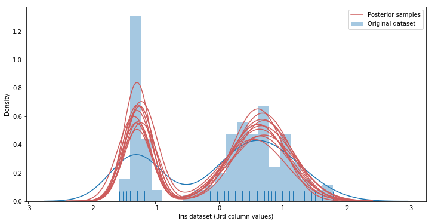

# Dirichlet mixture processes
## Where do people sit in a Chinese restaurant?

## Introduction and intuition
I have been wanting to write about Dirichlet processes (DP) for some time now, but I have never had the chance to wrap my mind around this topic which I consider to be one the most challenging of modern statistics.
In particular, I found hard to understand how the famous Chinese restaurant process (CRP) is intimately linked to the abstract concept behind a Dirichlet process.
This was until I read Chapter X of this book, where the author shows how the CRP is a natural descendant (or literally the same thing) of a Dirichlet process.

From these, the author shows how DPs are intimately related to clustering, a class of algorithms for which the number of clusters is iteratively defined by the process itself. 
In the following paragraphs, I will try to give a concise explanation of DP processes and how they could be used to determine the number of clusters for a dataset. 

## Intuition and formal model description
A Dirichlet process is a distribution over distributions, so instead of generating a single parameter (vector) a single draw from a DP outputs another (discrete) distribution. 
As tricky as it sounds, we can develop some intuition for DP through the following example borrowed from genomics data analysis. Let's say we have a a dozen blood samples of the same person over the course of a treatment: 
for each blood sample we have measurements for about ~30 k genes and we are interested in capturing patterns of co-espressions, i.e. genes whose expression co-vary hinting at shared regulatory processes.
One obvious solution to this is clustering, although it be may hard (if not impossible) to decide a priori what the number of clusters will be (assuming we plan to use K-means).
The number of co-expression patterns is not known, moreover clustering itself is used as a tool to identify novel co-regulatory circuits that could be targeted in therapeutic settings. 
By using a Dirichlet process we circumvent the need to specify the number of clusters ahead of time.

Let's naively start modeling our dataset by supposing that there are K clusters of normally distributed expression patterns (as in microarray experiments) and that the variance `sigma` is known. 
I'll now use a notation which may be easier to understand for those already familiar with mixture models. 
The following is the generative model for data points :


And the probability that  is equal to k is equal to , which can be regarded
as a prior on the cluster k as with Gaussian mixture models:


This prior is drawn from a Dirichlet distribution which is symmetric (we have no initial information distinguishing the clusters):


...knowing that every cluster mean  is drawn from a base distribution `H` (which for most applications can be a Gaussian distribution with 0 mean and standard deviation equal to 1):


What this all means is that we'll put identical priors  over every  that is generated,
and that according to what we know they are all equally probable, as indicated by the parametrization of the Dirichlet prior distribution. 
The parameters  and  are instead fixed parameters, reflecting
our prior knowledge of the system we are modeling.

What written in the paragraph above refers to a Dirichlet mixture model of K component, i.e. we must know the number of clusters in advance in order to assign observations to clusters.
In order to understand what a DP is though, we need to rewrite our model using a slightly different notation:


Let's stop to think for a second about the subscript `i`: we are not reasoning anymore in terms of clusters `k`, we suppose instead that every observation `i` in our dataset is associated with a parameter
, which is in turn drawn from some discrete distribution G with support on the K means:


Where  is the Dirac delta, which is basically an indicator function centered on 
And again, we draw  from a symmetric Dirichlet distribution:


...and we sample  as usual:


We now have all the tools to describe a Dirichlet process, just by extending the sum in the G distribution definition to an infinite number of clusters K: 
And we represent the overall model in a more compact way:


Now remember that a Dirichlet process is defined as a distribution over distributions Gs, so we can write:


Now, a discrete prior distribution with an infinite number of components may constitute an interesting mind experiment, but of course we need to find a way to sample from this distribution, 
and moreover given a dataset `D` we would like to derive the posterior distribution .

## The stick-breaking process: how to sample from a DP 

As we have seen in the previous paragraph, draws from a Dirichlet process are distributions over a set S which is infinite in size, so what we do is to truncate its dimension to a lower value, keeping
in mind that higher the value slower the convergence once of our model. 
Having said that, let's try to understand what the stick-breaking process does to approximate a sample draw from a DP. As noted earlier, this is the function we need to approximate:


We note that this random variable is in turn parametrized by two sets of random variables: the location parameters  
(e.g. ) and the corresponding probabilities 
We already know how sample  from and H distribution (which may as well be a Normal distribution), but generating the (potentially infinite) vector 
is more difficult. The rather brilliant solution to this problem is provided by the stick-breaking process, that samples K (which again is a very large - potentially infinite - number) numbers from a Beta distribution parametrized by 1 and a  of our choice.
Then, it recursively breaks a stick of unitary length by the sampled beta draws, in this way:


We note that the smaller the  is, the less of the stick will be left for subsequent values (on average), yielding more concentrated distributions.

Having all the building blocks in place, we can try to sample from a Dirichlet process, keeping in mind that the distribution `G` (which is a sample from a DP) is parametrized by  
(which is the potentially infinite vector resulting from the stick-breaking process) and  (the 'locations' vector resulting from repeated sampling of the base distribution H).

```python
def DP(h, alpha):
    n = max(int(5 * alpha + 2), 500)
    pi = stats.beta(1, alpha).rvs(size=n) # sample weights
    pi[1:] = pi[1:] * (1 - pi[:-1]).cumprod() # stick-breaking
    theta = h(size=n) # random draws from h
    return pi, theta # return parameters of G
        
def plot_normal_dp_approximation(alpha, n=2):
    pi, theta = DP(stats.norm.rvs, alpha)
    x = np.linspace(-3, 3, 100)
    
    plt.figure(figsize=(14, 4))
    plt.suptitle(r'Two samples from DP($\alpha$). $\alpha$ = {}'.format(alpha))
    plt.ylabel(r'$\pi$')
    plt.xlabel(r'$\theta$')
    pltcount = int('1' + str(n) + '0')
    
    for i in range(n):
        pltcount += 1
        plt.subplot(pltcount)
        pi, theta = dirichlet_process(stats.norm.rvs, alpha)
        pi = pi * (stats.norm.pdf(0) / pi.max())
        plt.vlines(theta, 0, pi, alpha=0.5)
        plt.ylim(0, 1)
        plt.plot(x, stats.norm.pdf(x))

np.random.seed(3)
for alpha in [1, 10, 100]:
    plot_normal_dp_approximation(alpha)

```


## How to calculate the posterior

Let's move on now to 
-- Dirichlet-multinomial conjugate posterior: https://stats.stackexchange.com/questions/44494/why-is-the-dirichlet-distribution-the-prior-for-the-multinomial-distribution
-- For the posterior form: http://www.stats.ox.ac.uk/~teh/research/npbayes/Teh2010a.pdf

-- For the predictive posterior https://www.cs.cmu.edu/~epxing/Class/10708-14/scribe_notes/scribe_note_lecture19.pdf page 5

## The Chinese restaurant process 

```python
import random
import matplotlib.pyplot as plt
from pylab import rcParams
rcParams['figure.figsize'] = 18, 6

fig, axs = plt.subplots(1, 3)
plot_count = 0
fig.suptitle('Chinese Restaurant Process customers distribution')

# Play with different concentrations
for concentration in [0.1, 1.0, 10]:

    # First customer always sits at the first table
    tables = [1]

    for n in range(2,100):

        # Get random number 0~1
        rand = random.random()

        p_total = 0
        existing_table = False

        for index, count in enumerate(tables):

            prob = count / (n + concentration)

            p_total += prob
            if rand < p_total:
                tables[index] += 1
                existing_table = True
                break

        # New table!!
        if not existing_table:
             tables.append(1)

    axs[plot_count].bar([i for i in range(len(tables))], tables)
    axs[plot_count].set_title(r'Concentration ($\alpha$) = {}'.format(concentration))
    plot_count+= 1
    for ax in axs.flat:
        ax.set(xlabel='Table number', ylabel='N customers')
```


## Inference on the number of clusters
    https://docs.pymc.io/notebooks/dp_mix.html

Let's download some data to cluster using mixture models:
```python
from sklearn.datasets import load_iris
import pandas as pd

df = pd.DataFrame(load_iris()['data'])
y = df.values
# Standardize the data
y = (y - y.mean(axis=0)) / y.std(axis=0)
```
   
... let's plot the mixture density:
```python
import seaborn as sns

plt.figure(figsize=(12, 6))
plt.title('Histogram of the 3d column of the (standardized) Iris dataset.')
plt.xlabel('x')
plt.ylabel('count')
sns.distplot(y[:, 3], bins=20, kde=False, rug=True)
``` 


Let's now build this model:


```python
import pymc3 as pm
from theano import tensor as tt

def stick_breaking(beta):
    portion_remaining = tt.concatenate([[1], tt.extra_ops.cumprod(1 - beta)[:-1]])
    return beta * portion_remaining

K = 30

with pm.Model() as model:
    alpha = pm.Gamma('alpha', 1., 1.)
    beta = pm.Beta('beta', 1., alpha, shape=K)
    w = pm.Deterministic('w', stick_breaking(beta))

    tau = pm.Gamma('tau', 1., 1., shape=K)
    lambda_ = pm.Uniform('lambda', 0, 5, shape=K)
    mu = pm.Normal('mu', 0, tau=lambda_ * tau, shape=K)
    obs = pm.NormalMixture('obs', w, mu, tau=lambda_ * tau,
                           observed=y[:, 2])
                           
with model: 
    step = None
    trace = pm.sample(500, tune=500, init='advi', random_seed=35171, step=step)                          
```

Draw sample from the posterior to evalute mixture model fit:

```python
x_plot = np.linspace(-2.4, 2.4, 200)
# Calculate pdf for points in x_plot
post_pdf_contribs = sp.stats.norm.pdf(np.atleast_3d(x_plot),
                                      trace['mu'][:, np.newaxis, :],
                                      1. / np.sqrt(trace['lambda'] * trace['tau'])[:, np.newaxis, :])
# Weight (Gaussian) posterior probabilities by the posterior of w
post_pdfs = (trace['w'][:, np.newaxis, :] * post_pdf_contribs).sum(axis=-1)
```

... and plot them ...

```python
import seaborn as sns

# fig, ax = plt.subplots(figsize=(8, 6))
rcParams['figure.figsize'] = 12, 6
sns.distplot(y[:, 2], rug=True, label='Original dataset', bins=20)

plt.plot(x_plot, post_pdfs[0],
        c='#CD5C5C', label='Posterior samples'); # Add this to plot the legend
plt.plot(x_plot, post_pdfs[::100].T, c='#CD5C5C');


plt.xlabel('Iris dataset (3rd column values)');
# plt.yticklabels([]);
plt.ylabel('Density');

plt.legend();
```



## Equation editor
- https://www.codecogs.com/latex/eqneditor.php (char is Helvetica, 10pts, 150 dpi)

## References:
- https://www.ritchievink.com/blog/2018/06/05/clustering-data-with-dirichlet-mixtures-in-edward-and-pymc3/
- https://docs.pymc.io/notebooks/dp_mix.html
- http://www.stats.ox.ac.uk/~teh/research/npbayes/Teh2010a.pdf
- https://www.cs.cmu.edu/~epxing/Class/10708-14/scribe_notes/scribe_note_lecture19.pdf