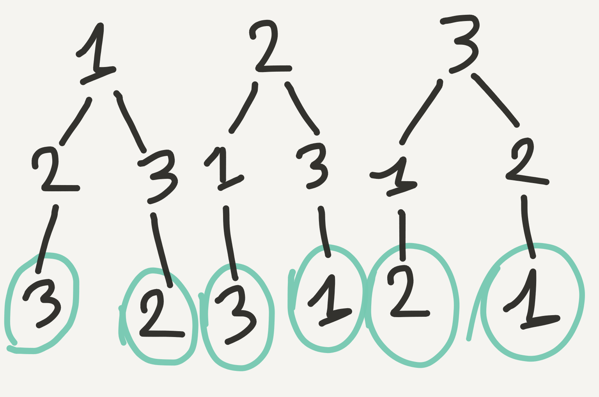

# Dynamic programming
## On how a simple exercise can help you to tackle dp questions

In terms of mathematical optimization, dynamic programming (dp) usually refers to simplifying a decision by breaking it down into a sequence of decision steps over time. It was invented by Richard Bellman in the 1950s and has found applications in numerous fields, from aerospace engineering to economics.
You may have heard the same name when dealing with reinforcement learning applications, as the Bellman equation it is still at the center of modern techniques for RL problems optimization (although dynamic programming in this context has given way to other techniques, namely deep learning and Monte Carlo simulations).
I will briefly summarize the main concepts behind dp.

DP is a method for solving problems by breaking it down into a collection of simpler sub-problems, solving each of those subproblems just once, and storing their solutions. What does it mean? Let us try to visualize one classical dp problem and come up with a simple (re-usable) solution that we will use in different contexts.
The problem I am referencing here (https://leetcode.com/problems/permutations/description/) is the classical '**permutations problem**', i.e. given an array containing n numbers or letters generate all the possible permutations (whose number is the factorial of n, n!).

Statement of the problem:
```
Input: [1,2,3]
Output:
[
  [1,2,3],
  [1,3,2],
  [2,1,3],
  [2,3,1],
  [3,1,2],
  [3,2,1]
]
```
Let us try to picture the different choices/permutations we get when dealing with permutations (fig.1):


In this representation each 'chain' of subsequent numbers represent a permutation that our program will explore and output. The green circle around the last position in the graph means that our program (when generating permutations) will stop when the current length of the current branch is equal to the length of the input array [1,2,3]. This may sound trivial, but it is essentially what we need as a 'termination' condition of our recursive exploration.
We see that a simple strategy to generate all possible permutations is to put in the first position of our sequences the numbers of the input list in turn, and from there permute sub-sequences excluding the 'head of the chain', i.e. the selected number.

We know write the code using a simple yet very useful pattern for graph exploration (which I got from a lesson of the Stanford CS 106B course): it is called "choose-explore-unchoose", and can be described in the following way:
- Use an iterator to list all the possible starting points for our recursion (every number in our list) (the 'for' loop in the explore_helper function below)
- 'Choose': select one number by adding it to a stack that holds the current branch 
- 'Explore': recursively call the 'explore_helper' function which will carry on the recursion and pass along the stack which contains the numbers chosen in the current branch
- 'Unchoose': remove the recently added number and go back to step 1 to explore another sub-branch.
The termination condition that will stop the recursion and add the current branch to the 'results' list is given (as previously stated) by the comparison between the length of the branch and the length of the original list to permute ([1,2,3])

With this code we are recursively exploring a graph just by selecting an item (choose), calling a function that will carry on the recursion (explore) and going back to where we came from (unchoose) to explore another sub-branch of the graph until we are done.

This is the Python soution that passes the testcases in 25 ms (a bit slow, I will tell you later about performance):
```python
class Solution:
    def permute(self, nums):
        """
        :type nums: List[int]
        :rtype: List[List[int]]
        """
        if not nums: return []
        results=[]
        self.explore_helper(nums, results)
        return results
 
    def explore_helper(self, alist, results, partial_result=[]):
        if len(partial_result) == len(alist):
            results.append(partial_result.copy())
        else:
            for i in range(len(alist)):
                if alist[i] in partial_result: continue
                partial_result.append(alist[i]) # CHOOSE
                self.explore_helper(alist, results, partial_result) # EXPLORE
                partial_result.pop() # UNCHOOSE
```
One thing to notice here is that we are using a Python list to hold the 'explored' solutions and then we are checking on line 17 if our number is already contained in it (we want to avoid repetition in permutations). Unfortunately, every time we execute this line Python needs to through every item contained in the list, making this step O(n). In order to optimize this step we would need to use an extra Python set to hold the selected numbers, making this step O(1).
