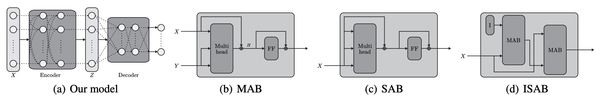
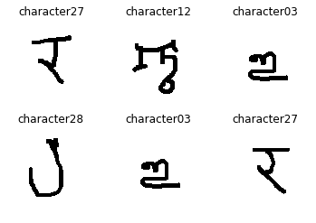

# Paper review & (TensorFlow) code: Set Transformer
## Set Transformer, ICML 2019


In a [previous post](https://arrigonialberto86.github.io/funtime/deepsets.html) I talked about functions preserving 
*permutation invariance* with respect to input data (i.e. sets of data points such as items in a shopping cart).
If you are not familiar with this concept please review that post or refer to the original [DeepSet paper](https://arxiv.org/abs/1703.06114).

I this post we will go through the details of a recent paper that leverage the idea of attention and the overall transformer architecture
to attain input permutation invariance, and solves some of the shortcomings connected with the naive pooling operation we used in
DeepSets. You can find the original publication by Lee et al. [here](https://arxiv.org/pdf/1810.00825.pdf): Set Transformer: A Framework for Attention-based
Permutation-Invariant Neural Networks.


In the DeepSet publication the authors suggest to use a simple pooling function (*sum* or *mean*) to combine together different 
branches of a neural network (each one processing one data point independently but with shared weights). Although this simple solution
effectively works as intended, by pooling different vectors together we are 'squashing' the information contained in source data and 
losing information about higher-order interactions which may exist among members of the set.
The **Set Tranformer** architecture suggested in the aforementioned publication tackles these shortcomings by providing a richer
representation of input data that capture higher-order interactions and parametrizes the *pooling* operation so that no information
is lost after combining data points. 


## Paper contributions


I am releasing this blog post with a companion Python package available on Github: [set_transformer](https://github.com/arrigonialberto86/set_transformer)

It has been observed before [before](https://arxiv.org/abs/1706.03762) that the transformer architecture ([here](http://jalammar.github.io/illustrated-transformer/) 
you can find a very nice 'visual' explanation) without positional encoding
does not retain information regarding the order by which the input words are being supplied. Thus, it makes sense to suppose that
the attention mechanism (which constitutes the basis of the Transformer architecture) could be used to process sets of elements in the same way
as we have seen for the DeepSet architecture. In Lemma 1 of the their paper, Lee et al. demonstrate that the mean operator (i.e. a pooling function we have talked about)
is a special case of dot-product attention with softmax (i.e. the self-attention mechanism). 
If this sounds strange to you (or, on the other hand, too simple to be true) I can provide an informal explanation of what self-attention is,
and why it matters in so many different contexts. 

Let us say we have a set of `f`-dimensional elements/vectors (in the classical NLP context these would be one-hot-encoded vectors to be subsequently
projected down to an embedding space, here just feature vectors). Since here we are processing *sets* we do not care about the order, 
just know that we have a `n x f` input matrix `N`. We project this matrix into 3 separate new matrices that are referred to as **keys** (K), **queries** (Q), and **values** (V).
The projection matrices will be learned during training just like any other parameters in the model. During training the projection matrices will learn how to produce queries, 
keys and values that will lead to optimal attention weights.

Let us just take a pair of feature vectors to make this concrete (and hopefully clearer): vector `a` and `b` both defined in .
We now use the three projection matrices K, Q and V (which are all trainable as said before) to obtain three versions (possibly very different according to parametrization)
of the input vector `a`, i.e. `a_Q`, `a_K`, `a_V`, whose dimensionality depends on K, Q, and V (this is an hyperparameter that needs tuning).
We do the same thing for `b` to obtain `b_Q`, `b_K`, `b_V`. The two-vector set (`{a, b}`) has now been converted to two lists of vectors.
What we would like to understand with these operations (the whole attention mechanism) is how much `a` is *related* to itself and `b`, or put in other terms:
do I need `b` when predicting a target related to `a` or all the information I need is already present in `a`?

We can calculate how related `a` is to itself first by multiplying (via the inner product) its query (a_q) and key (a_k) together. 
Remember, we compute all pairwise interactions between nodes include self-interactions, and unsurprisingly objects are likely to be related to themselves, 
but not necessarily since the corresponding queries and keys (after projection) may be different.

What we get by the queries (Q) and keys (K) product is a unnormalized attention weight matrix, which we later normalize by using a **softmax** function.
Once we have the normalized attention weights, we then multiply these by the corresponding value matrix (V) to focus on only certain salient parts of the value (V) matrix, and this will give us a new and updated node matrix:


The `QK^T` matrix is a `nxn` matrix which encoded the pairwise relationships between the elements of the input set.
We then multiply this by the value (V) matrix, which will update each feature vector according to its interactions with other elements, such that the final result is an updated set matrix.

What is truly remarkable about this encoding process is that is flexible enough to be useful in very different contexts: in NLP (where attention was conceived) 
the weight matrix represents how much one word is relevant for the translation of another word, i.e. the contextual information, in graph neural network the `QK^T` matrix
becomes the weighted adjacency matrix of the graph (more on this [here](https://graphdeeplearning.github.io/post/transformers-are-gnns/)). 

Let us put these words into code:

```python
import tensorflow as tf


# https://www.tensorflow.org/tutorials/text/transformer, appears in "Attention is all you need" NIPS 2018 paper
def scaled_dot_product_attention(q, k, v, mask):
    """Calculate the attention weights.
    q, k, v must have matching leading dimensions.
    k, v must have matching penultimate dimension, i.e.: seq_len_k = seq_len_v.
    The mask has different shapes depending on its type(padding or look ahead)
    but it must be broadcastable for addition.
    Args:
    q: query shape == (..., seq_len_q, depth)
    k: key shape == (..., seq_len_k, depth)
    v: value shape == (..., seq_len_v, depth_v)
    mask: Float tensor with shape broadcastable
          to (..., seq_len_q, seq_len_k). Defaults to None.
    Returns:
    output, attention_weights
    """

    matmul_qk = tf.matmul(q, k, transpose_b=True)  # (..., seq_len_q, seq_len_k)

    # scale matmul_qk
    dk = tf.cast(tf.shape(k)[-1], tf.float32)
    scaled_attention_logits = matmul_qk / tf.math.sqrt(dk)

    # add the mask to the scaled tensor.
    if mask is not None:
        scaled_attention_logits += (mask * -1e9)

    # softmax is normalized on the last axis (seq_len_k) so that the scores
    # add up to 1.
    attention_weights = tf.nn.softmax(scaled_attention_logits, axis=-1)  # (..., seq_len_q, seq_len_k)

    output = tf.matmul(attention_weights, v)  # (..., seq_len_q, depth_v)

    return output, attention_weights
```

From here it is easy (at least conceptually) to extend our framework to multi-head attention: instead of having a single attention function,
this method projects Q,K and V onto `h` different triplets of vectors.  
An attention function is applied to each of these `h` projections and the output is a linear transformation of the concatenation of all attention outputs.

For an implementation of multihead attention see [here](https://github.com/arrigonialberto86/set_transformer/blob/master/set_transformer/layers/attention.py).
For simplicity, we define the `Multihead` function, which receives Q, K, V, parameters w and returns the encoded vector (for a dimensionality
check on input/output vectors you may want to reference [these unit tests](https://github.com/arrigonialberto86/set_transformer/blob/master/tests/test_attention.py) I wrote
for the package). 


## The network structure

The network structure proposed by Lee et al. closely resembles a Transformer, complete with an encoder and a decoder network, but a distinguishing feature is that each
layer in the encoder and decoder attends to their inputs to produce activations.

The encoder and the decoder are built by *almost* the same building blocks, the main difference is that in the decoder they introduce a block that performs
pooling by using a parametric function (a neural network) (PMA), so that is can model more complex relationships than the *mean* operator used elsewhere.
These are the building blocks of their model:


ENCODER = SAB(SAB(X))    with output Z, input of the decoder

DECODER = rFF(SAB(PMA(Z)))



In the following sections we go through the listed building blocks of the network to give a formal definition and implementation.


### Permutation equivariant Set Attention Blocks (SAB)

Since using self-attention to concurrently encode the whole set of input data, we recall the Multihead Attention Block (MAB) with parameters `w` (as in the publication).
Given input matrices X and Y (both of dimensionality `n` x `d`) we define a MAB as:

MAB(X, Y) = LayerNorm(H + RFF(H))

where H = LayerNorm(X + Multihead(X,Y,Y; w)) 

rFF is any row-wise feedforward layer and LayerNorm is (of course) layer normalization. An rFF can be implemented like this:

```python
import tensorflow as tf
from tensorflow.keras.layers import Dense


class RFF(tf.keras.layers.Layer):
    """
    Row-wise FeedForward layers.
    """

    def __init__(self, d):
        super(RFF, self).__init__()

        self.linear_1 = Dense(d, activation='relu')
        self.linear_2 = Dense(d, activation='relu')
        self.linear_3 = Dense(d, activation='relu')

    def call(self, x):
        """
        Arguments:
            x: a float tensor with shape [b, n, d].
        Returns:
            a float tensor with shape [b, n, d].
        """
        return self.linear_3(self.linear_2(self.linear_1(x)))
```

With the MAB in place (which is just an adaptation of the encoder block of the Transformer but without positional encoding) we can now define the 
Set Attention Block (SAB):

SAB(X) := MAB(X, X)

And this is a SAB layer tf implementation:

```python
class SetAttentionBlock(tf.keras.layers.Layer):
    def __init__(self, d: int, h: int, rff: RFF):
        super(SetAttentionBlock, self).__init__()
        self.mab = MultiHeadAttentionBlock(d, h, rff)

    def call(self, x):
        """
        Arguments:
            x: a float tensor with shape [b, n, d].
        Returns:
            a float tensor with shape [b, n, d].
        """
        return self.mab(x, x)
```

You may have noticed an issue with this implementation: for set structured data we need to derive an all-vs-all matrix of weights which results
in a squared complexity of the algorithm ().
The authors come up with a clever way to reduce the complexity to , 
where `m` is the dimensionality of trainable 'inducing points'. These 'inducible' vectors are in fact trainable parameters that are learned during training
along with all the others. You may picture this operation as making a low-rank projection or using an under-complete autoencoder model.
Let us slightly modify our SAB implementation to obtain an ISAB:

```python
class InducedSetAttentionBlock(tf.keras.layers.Layer):
    def __init__(self, d: int, m: int, h: int, rff1: RFF, rff2: RFF):
        """
        Arguments:
            d: an integer, input dimension.
            m: an integer, number of inducing points.
            h: an integer, number of heads.
            rff1, rff2: modules, row-wise feedforward layers.
                It takes a float tensor with shape [b, n, d] and
                returns a float tensor with the same shape.
        """
        super(InducedSetAttentionBlock, self).__init__()
        self.mab1 = MultiHeadAttentionBlock(d, h, rff1)
        self.mab2 = MultiHeadAttentionBlock(d, h, rff2)
        self.inducing_points = tf.random.normal(shape=(1, m, d))

    def call(self, x):
        """
        Arguments:
            x: a float tensor with shape [b, n, d].
        Returns:
            a float tensor with shape [b, n, d].
        """
        b = tf.shape(x)[0]
        p = self.inducing_points
        p = repeat(p, (b), axis=0)  # shape [b, m, d]

        h = self.mab1(p, x)  # shape [b, m, d]
        return self.mab2(x, h)
```

We now have all the ingredients to write the encoder layer of our model:

```python
class STEncoder(tf.keras.layers.Layer):
    def __init__(self, d=12, m=6, h=6):
        super(STEncoder, self).__init__()

        # Embedding part
        self.linear_1 = Dense(d, activation='relu')

        # Encoding part
        self.isab_1 = InducedSetAttentionBlock(d, m, h, RFF(d), RFF(d))
        self.isab_2 = InducedSetAttentionBlock(d, m, h, RFF(d), RFF(d))

    def call(self, x):
        return self.isab_2(self.isab_1(self.linear_1(x)))
```

### Pooling by Multihead Attention (PMA block) 

We said before that feature aggregation is commonly performed by dimension-wise averaging. The authors propose instead to apply multihead attention 
on a learnable set of `k` seed vectors (S). The idea is not dissimilar to what we saw for ISAB and has the following structure (remember that Z is the encoder's output):

PMA(Z) = MAB(S, rFF(Z))

To complete the decoder layer, we apply a SAB on the output of PMA:

H = SAB(PMA(Z))

The implementation of the Multihead Attention Block (MAB) looks like this:

```python
class PoolingMultiHeadAttention(tf.keras.layers.Layer):

    def __init__(self, d: int, k: int, h: int, rff: RFF, rff_s: RFF):
        """
        Arguments:
            d: an integer, input dimension.
            k: an integer, number of seed vectors.
            h: an integer, number of heads.
            rff: a module, row-wise feedforward layers.
                It takes a float tensor with shape [b, n, d] and
                returns a float tensor with the same shape.
        """
        super(PoolingMultiHeadAttention, self).__init__()
        self.mab = MultiHeadAttentionBlock(d, h, rff)
        self.seed_vectors = tf.random.normal(shape=(1, k, d))
        self.rff_s = rff_s

    @tf.function
    def call(self, z):
        """
        Arguments:
            z: a float tensor with shape [b, n, d].
        Returns:
            a float tensor with shape [b, k, d]
        """
        b = tf.shape(z)[0]
        s = self.seed_vectors
        s = repeat(s, (b), axis=0)  # shape [b, k, d]
        return self.mab(s, self.rff_s(z))
```

The resulting decoder looks like this:

```python
class STDecoder(tf.keras.layers.Layer):
    def __init__(self, out_dim, d=12, h=2, k=8):
        super(STDecoder, self).__init__()

        self.PMA = PoolingMultiHeadAttention(d, k, h, RFF(d), RFF(d))
        self.SAB = SetAttentionBlock(d, h, RFF(d))
        self.output_mapper = Dense(out_dim)
        self.k, self.d = k, d

    def call(self, x):
        decoded_vec = self.SAB(self.PMA(x))
        decoded_vec = tf.reshape(decoded_vec, [-1, self.k * self.d])
        return tf.reshape(self.output_mapper(decoded_vec), (tf.shape(decoded_vec)[0],))
```

## A toy problem: maximum value regression

To show the advantage of attention-based set aggregation over simple pooling operations, the authors consider regression to the maximum value
of a given set. Let us generate a random dataset to be used for learning:

```python
import numpy as np
import tensorflow as tf


def gen_max_dataset(dataset_size=100000, set_size=9, seed=0):
    """
    The number of objects per set is constant in this toy example
    """
    np.random.seed(seed)
    x = np.random.uniform(1, 100, (dataset_size, set_size))
    y = np.max(x, axis=1)
    x, y = np.expand_dims(x, axis=2), np.expand_dims(y, axis=1)
    return tf.cast(x, 'float32'), tf.cast(y, 'float32')
```

And then using the APIs from the `set_transformer` package we can write:

```python
from set_transformer.data.simulation import gen_max_dataset
from set_transformer.model import BasicSetTransformer
import numpy as np

train_X, train_y = gen_max_dataset(dataset_size=100000, set_size=9, seed=1)
test_X, test_y = gen_max_dataset(dataset_size=15000, set_size=9, seed=3)

set_transformer = BasicSetTransformer()
set_transformer.compile(loss='mae', optimizer='adam')
set_transformer.fit(train_X, train_y, epochs=3)
predictions = set_transformer.predict(test_X)
print("MAE on test set is: ", np.abs(test_y - predictions).mean())
```

which quickly results in :

```bash
Train on 100000 samples
Epoch 1/3
100000/100000 [==============================] - 27s 270us/sample - loss: 32.8959
Epoch 2/3
100000/100000 [==============================] - 20s 197us/sample - loss: 6.6131
Epoch 3/3
100000/100000 [==============================] - 22s 216us/sample - loss: 6.4121
MAE on test set is:  6.558687
```

You can go ahead and compare the results obtained with this approach with the other architectures employing `mean` and `max` pooling operations.
Notably, the authors report that the Set Transformer achieves performance comparable to the max-pooling model

## Counting unique characters

In this example I will just set the stage for a run using the `set_transformer` APIs. The reference dataset is called 'Omniglot', 
which consists of 1,623 different handwritten characters from various alphabets, where each character is represented by 20 different images.
Characters are sampled at random from this dataset and the task at hand is to predict the number of unique characters present in the input set.

```python
import numpy as np
import matplotlib.pyplot as plt
%matplotlib inline
from tqdm.notebook import tqdm
from typing import List


# Get list of different character paths
img_dir = './images_background'
alphabet_names = [a for a in os.listdir(img_dir) if a[0] != '.'] # get folder names
char_paths = []
for lang in alphabet_names:
    for char in [a for a in os.listdir(img_dir+'/'+lang) if a[0] != '.']:
        char_paths.append(img_dir+'/'+lang+'/'+char)

char_to_png = {char_path: os.listdir(char_path) for char_path in tqdm(char_paths)}


def draw_one_sample(char_paths: List, sample_size=6):
    n_chars = np.random.randint(low=1, high=sample_size, size=1)
    selected_chars = np.random.choice(char_paths, size=n_chars, replace=False)
    rep_char_list = selected_chars.tolist() + \
                    np.random.choice(selected_chars, size=sample_size-len(selected_chars), replace=True).tolist()
    sampled_paths = [char_path+'/'+np.random.choice(char_to_png[char_path]) for char_path in rep_char_list]
    return sampled_paths, n_chars[0]

sampled_paths, n_chars = draw_one_sample(char_paths, sample_size=6)
```

And that is what a random sample looks like:

```python

from matplotlib.figure import Figure
from numpy import ndarray
from typing import List
import matplotlib.image as mpimg

def render_chart(fig: Figure, axis: ndarray, image_id: int, data_list: List):
    image = mpimg.imread(data_list[image_id])
    axis.title.set_text(data_list[image_id].split('/')[-2])
    axis.axis('off')
    axis.imshow(image, cmap='gray')

print('Number of selected characters is {}'.format(n_chars))    

fig, axs = plt.subplots(2, 3)
render_chart(fig=fig, axis=axs[0, 0], image_id=0, data_list=sampled_paths)
render_chart(fig=fig, axis=axs[0, 1], image_id=1, data_list=sampled_paths)
render_chart(fig=fig, axis=axs[0, 2], image_id=2, data_list=sampled_paths)
render_chart(fig=fig, axis=axs[1, 0], image_id=3, data_list=sampled_paths)
render_chart(fig=fig, axis=axs[1, 1], image_id=4, data_list=sampled_paths)
render_chart(fig=fig, axis=axs[1, 2], image_id=5, data_list=sampled_paths)
```




## Conclusion

I encourage you to read the original paper (complete with supplementary materials) where the authors show useful theoretical properties of the Set Transformer,
, including the fact that it is a universal approximator for permutation invariant functions. 

I was also surprised to see that among the future developments of this work they suggest that Set Transformer can be used to meta-learn posterior inference 
in Bayesian models (did not see that coming!)

## Reference
- "Attention is all you need", 2017, https://arxiv.org/abs/1706.03762
- "Set Transformer: A Framework for Attention-based Permutation-Invariant Neural Networks", 2019, https://arxiv.org/pdf/1810.00825.pdf

## Equation editor
- https://www.codecogs.com/latex/eqneditor.php (Latin Modern, 12pts, 150 dpi)