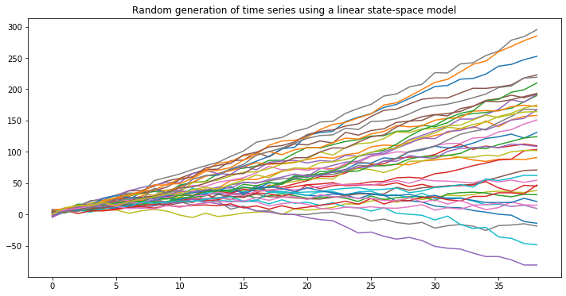

# Level-trend State Space Models (SSMs)
## A PyTorch implementation from scratch

A State Space Model (SSM) is a model that uses state variables to describe a system by a set of first-order differential equations.
They model the temporal structure of the data via a latent state l_t ∈ R that can be used to encode time series components such as level, trend, and seasonality patterns.
Among the infinite different flavors of SSMs that this definition potentially comprises I will focus on the simple linear-trend model, where the latent state l only references the level of a time series and its instantaneous trend.
State variables evolve over time in response to externally provided inputs, so that they can encode all the characteristics of a system and predict its behavior.
The main components of a SSM are a **transition** model, which describes how the latent state evolves over time and an observation model, which tells how to go from the latent space variables to the values we observe.

Let us start by defining the transition equation of our model:


Here you see a deterministic transition matrix F_t and a random innovation component summarized in vector 
As this is the general form of any SSM, we need to list the instantiation parameters of our simple level-trend model:


The previous equation refers to the dynamics of evolution of the latent state, which in turn generats real observations z_t through an *observation* model:


The parameters that specify this model are assumed to be fixed in time for our purposes, although in recent papers such as [this](https://papers.nips.cc/paper/8004-deep-state-space-models-for-time-series-forecasting.pdf) the parameters are predicted by a RNN at each time point, effectively creating a time-varying Deep State Space Model.
The backpropagation is simply performed by perfoming Kalman filtering (more on that later) and calculating the negative log likelihood at each time point using the Gaussian distribution defined by the observation model above. 

Let us start our description by simulating some time series using the generative model reported above and PyTorch:

```python
import torch
import matplotlib.pyplot as plt
%matplotlib inline
fig= plt.figure(figsize=(12,6))

def next_obs(current_l=torch.Tensor([0, 0]), a=torch.Tensor([1, 1]), 
             F = torch.Tensor([[1, 1], [0, 1]]), alpha=0.6, beta=0.6, 
             sigma_t=torch.Tensor([3])): 
    g = torch.Tensor([alpha, beta])
    y_t = torch.matmul(a.T, current_l)
    z_t = y_t + sigma_t * torch.empty(1).normal_(mean=0,std=1)
    next_l = torch.matmul(F, current_l) + g * torch.empty(1).normal_(mean=0,std=1)
    return next_l, z_t

def simulate_single_ts(n_obs = 39):
    sim_list = []
    current_obs = torch.Tensor([0, 3])
    for i in range(n_obs):
        current_obs, z_t = next_obs(current_l=current_obs)
        sim_list.append(z_t)
    return sim_list

for i in range(39):
    plt.plot(simulate_single_ts())
plt.title('Random generation of time series using a linear state-space model')
```



I have talked above about the Kalman filter. Although it is not in the scope of this post a detailed explanation of the mechanics of filtering I will just go ahead and list the formulas that will be implemented in the below.
Kalman filtering is composed of three recurrent steps:

## Forecasting


Then (to be clear) sample from the forecast distribution by assuming a Gaussian likelihood:


## Updating (state filtering)


## State prediction


## Equation editor
- https://www.codecogs.com/latex/eqneditor.php (Latin Modern, 12pts, 150 dpi)