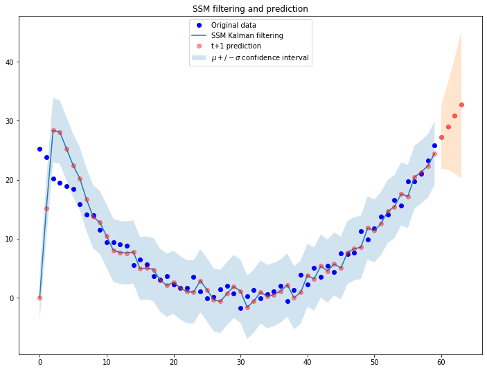

# Level-trend State Space Models (SSMs)
## A PyTorch implementation from scratch

A State Space Model (SSM) is a model that uses state variables to describe a system by a set of first-order differential equations.
They model the temporal structure of the data via a latent state l_t ∈ R that can be used to encode time series components such as level, trend, and seasonality patterns.
Among the infinite different flavors of SSMs that this definition potentially comprises I will focus on the simple linear-trend model, where the latent state l only references the level of a time series and its instantaneous trend.
State variables evolve over time in response to externally provided inputs, so that they can encode all the characteristics of a system and predict its behavior.
The main components of a SSM are a **transition** model, which describes how the latent state evolves over time and an observation model, which tells how to go from the latent space variables to the values we observe.

Let us start by defining the transition equation of our model:


Here you see a deterministic transition matrix F_t and a random innovation component summarized in vector 
As this is the general form of any SSM, we need to list the instantiation parameters of our simple level-trend model:


The previous equation refers to the dynamics of evolution of the latent state, which in turn generats real observations z_t through an *observation* model:


The parameters that specify this model are assumed to be fixed in time for our purposes, although in recent papers such as [this](https://papers.nips.cc/paper/8004-deep-state-space-models-for-time-series-forecasting.pdf) the parameters are predicted by a RNN at each time point, effectively creating a time-varying Deep State Space Model.
The backpropagation is simply performed by perfoming Kalman filtering (more on that later) and calculating the negative log likelihood at each time point using the Gaussian distribution defined by the observation model above. 

Let us start our description by simulating some time series using the generative model reported above and PyTorch:

```python
import torch
import matplotlib.pyplot as plt
%matplotlib inline
fig= plt.figure(figsize=(12,6))

def next_obs(current_l=torch.Tensor([0, 0]), a=torch.Tensor([1, 1]), 
             F = torch.Tensor([[1, 1], [0, 1]]), alpha=0.6, beta=0.6, 
             sigma_t=torch.Tensor([3])): 
    g = torch.Tensor([alpha, beta])
    y_t = torch.matmul(a.T, current_l)
    z_t = y_t + sigma_t * torch.empty(1).normal_(mean=0,std=1)
    next_l = torch.matmul(F, current_l) + g * torch.empty(1).normal_(mean=0,std=1)
    return next_l, z_t

def simulate_single_ts(n_obs = 39):
    sim_list = []
    current_obs = torch.Tensor([0, 3])
    for i in range(n_obs):
        current_obs, z_t = next_obs(current_l=current_obs)
        sim_list.append(z_t)
    return sim_list

for i in range(39):
    plt.plot(simulate_single_ts())
plt.title('Random generation of time series using a linear state-space model')
```


I have talked above about the Kalman filter. Although it is not in the scope of this post a detailed explanation of the mechanics of filtering I will just go ahead and list the formulas that will be implemented in the below.
Kalman filtering is composed of three recurrent steps:

## Forecasting


Then (to be clear) sample from the forecast distribution by assuming a Gaussian likelihood:


## Updating (state filtering)


## State prediction


We can now simply translate these equations to PyTorch by writing the `LevelTrendSSM` class:

```python
from torch import Tensor
from torch.distributions.normal import Normal

class LevelTrendSSM:
  def __init__(self, ts_data: Tensor):
    self.ts_data = ts_data
    self.g, sigma_t = None, None
    self.prediction_list, self.states_list = [], []

  @property
  def predictions(self):
    return self.prediction_list
  
  @property
  def states(self):
    return self.states_list

  # Linear-trend SSM dynamics
  a, F = torch.Tensor([1, 1]), torch.Tensor([[1, 1], [0, 1]])

  def _filter_init(self, alpha=1, beta=1, 
                   sigma_t=torch.Tensor([3]), 
                   f_0=torch.Tensor([0, 0]), 
                   S_0=torch.diag(torch.Tensor([1, 1]))):
    # Dispersion parameter of the hidden state update step
    self.g = torch.Tensor([alpha, beta])
    self.sigma_t = sigma_t

    # First prediction step using Gaussian prior for the hidden state l~N(f_0, S_0)
    z_mu = torch.matmul(self.a.T, f_0) 
    z_S = torch.matmul(torch.matmul(self.a.T, S_0), self.a) + torch.pow(sigma_t, 2)

    # Update according to real data
    residual = self.ts_data[0] - z_mu
    f_current = f_0 + torch.matmul(S_0, self.a) * 1/z_S * residual
    S_current = S_0 - torch.matmul(torch.matmul(S_0, self.a) * 1/z_S, self.a.T) * S_0 

    return z_mu, z_S, f_current, S_current

  def filter_ts(self, alpha=1, beta=1, 
                sigma_t=torch.Tensor([3]), 
                f_0=torch.Tensor([0, 0]), 
                S_0=torch.diag(torch.Tensor([3, 3]))):

    # Initialize data holder lists
    self.prediction_list, self.states_list = [], []

    z_mu, z_S, f_current, S_current = self._filter_init(alpha=alpha, beta=beta, 
                                                        sigma_t=sigma_t, 
                                                        f_0=f_0, 
                                                        S_0=S_0)
    self.prediction_list.append([z_mu, z_S])
    self.states_list.append([f_current, S_current])

    for datum in self.ts_data[1:]:
      # State prediction
      f_current = torch.matmul(self.F, f_current)
      S_current = torch.matmul(torch.matmul(self.F, S_current), self.F.T) + torch.matmul(self.g, self.g.T)

      # Forecasting step
      mu_predicted = torch.matmul(self.a.T, f_current)
      sigma_predicted = torch.matmul(torch.matmul(self.a.T, S_current), self.a) + torch.pow(self.sigma_t, 2)

      self.prediction_list.append([mu_predicted, sigma_predicted])
      
      # Update with real data
      residual = datum - mu_predicted
      f_current = f_current + torch.matmul(S_current, self.a) * 1/sigma_predicted * residual
      S_current = S_current - torch.matmul(torch.matmul(S_current, self.a) * 1/sigma_predicted, self.a.T) * S_current

      self.states_list.append([f_current, S_current])

  def predict(self, horizon: int) -> Tensor:
    assert horizon >= 1
    if not self.states_list:
      raise ValueError('You should call the "filter_ts" instance method first!')
    output_list = []
    f_current, S_current = self.states_list[-1][0], self.states_list[-1][1]

    for p in range(horizon): 
      # State prediction
      f_current = torch.matmul(self.F, f_current)
      S_current = torch.matmul(torch.matmul(self.F, S_current), self.F.T) + torch.matmul(self.g, self.g.T)

      # Forecasting step
      mu_predicted = torch.matmul(self.a.T, f_current)
      sigma_predicted = torch.matmul(torch.matmul(self.a.T, S_current), self.a) + torch.pow(self.sigma_t, 2)

      output_list.append([mu_predicted, sigma_predicted])
    return output_list
```

And the some code to call the class and fit a randomly generated time series:

```python
fig = plt.figure(figsize=(12,9))

# Simulate a ts
ts_len = len(ts_data)
ts_data = simulate_single_ts(n_obs=ts_len)
plt.plot(ts_data, 'bo', label='Original data')

# Filter and predict random ts 'ts_data'
prediction_horizon=4
ssm = LevelTrendSSM(ts_data)
ssm.filter_ts()
f_prediction = ssm.predict(prediction_horizon)

plt.plot([i[0] for i in ssm.prediction_list], label='SSM Kalman filtering')
plt.plot([i[0] for i in ssm.prediction_list], 'ro', label='t+1 prediction', alpha=0.4)
plt.fill_between(x=[i for i in range(ts_len)], 
                 y1=[i[0]-torch.sqrt(i[1]) for i in ssm.prediction_list], 
                 y2=[i[0]+torch.sqrt(i[1]) for i in ssm.prediction_list], alpha=.2, label=r'$\mu +/- \sigma$ confidence interval')

plt.plot([i for i in range(ts_len, ts_len+prediction_horizon)], 
         [i[0] for i in f_prediction], 'ro', alpha=0.6)
plt.fill_between(x=[i for i in range(ts_len, ts_len+prediction_horizon)], 
                 y1=[i[0]-torch.sqrt(i[1]) for i in f_prediction], 
                 y2=[i[0]+torch.sqrt(i[1]) for i in f_prediction], alpha=.2)

plt.legend(loc='center left')
plt.title('SSM filtering and prediction')
```


As expected, the system is dinamically reacting to the observations it receives from the external environment and adjusts the trajectory we observe.

## A matter of parameters initialization

It is often tricky to initialize SSMs parameters and the 'wrong' initialization can impair convergence, making the whole filtering process useless. 
As I was saying before, the negative log likelihood of the Gaussian distributions generated from filtering can be used to identify the most suitable set of parameters (this is exactly what we would also use to identify ARIMA parameters).

We first build a simple quadatic function to fit:

```python
ts_sim = [torch.pow(t, 2) + torch.empty(1).normal_(mean=0,std=1) for t in torch.linspace(-5, 5, 60)]
plt.plot(ts_sim, 'bo')
plt.plot(ts_sim)
```


Let us use the default init parameters [0, 0] of the class we wrote above to filter the function:

```python
fig = plt.figure(figsize=(12,9))

# Simulate a ts
ts_len = len(ts_sim)
ts_data = ts_sim
plt.plot(ts_data, 'bo', label='Original data')

# Filter and predict random ts 'ts_data'
prediction_horizon=4
ssm = LevelTrendSSM(ts_data)
ssm.filter_ts(f_0=torch.Tensor([0, 0]))
f_prediction = ssm.predict(prediction_horizon)

plt.plot([i[0] for i in ssm.prediction_list], label='SSM Kalman filtering')
plt.plot([i[0] for i in ssm.prediction_list], 'ro', label='t+1 prediction', alpha=0.4)
plt.fill_between(x=[i for i in range(ts_len)], 
                 y1=[i[0]-torch.sqrt(i[1]) for i in ssm.prediction_list], 
                 y2=[i[0]+torch.sqrt(i[1]) for i in ssm.prediction_list], alpha=.2, label=r'$\mu +/- \sigma$ confidence interval')

plt.plot([i for i in range(ts_len, ts_len+prediction_horizon)], 
         [i[0] for i in f_prediction], 'ro', alpha=0.6)
plt.fill_between(x=[i for i in range(ts_len, ts_len+prediction_horizon)], 
                 y1=[i[0]-torch.sqrt(i[1]) for i in f_prediction], 
                 y2=[i[0]+torch.sqrt(i[1]) for i in f_prediction], alpha=.2)

plt.legend(loc='upper center')
plt.title('SSM filtering and prediction')
```



We now exploit PyTorch to calculate the log-likehood function for different initialization parameters:

```python
def log_lik(actual: Tensor, predictions: Tensor):
  """
  :param actual -> simulated time series data
  :param predictions -> List[[mu, sigma]]
  """
  return torch.Tensor([Normal(i[0], i[1]).log_prob(j) 
                        for i,j in zip(predictions, actual)]).sum()
```

... and cycle through different values to obtain a likelihood profile:

```python
log_liks = []
for i in range(40):
  ssm = LevelTrendSSM(ts_sim)
  ssm.filter_ts(f_0=torch.Tensor([i, -1]))
  log_liks.append(log_lik(ts_sim, ssm.predictions))
plt.plot([i for i in range(40)], log_liks)
plt.plot([i for i in range(40)], log_liks, 'bo')
plt.axvline(x=26, label='Max log-likelihood: 26')
plt.legend()
```


Of course by updating the initial parameters according to what we found the fitting procedure works much better:


## Equation editor
- https://www.codecogs.com/latex/eqneditor.php (Latin Modern, 12pts, 150 dpi)