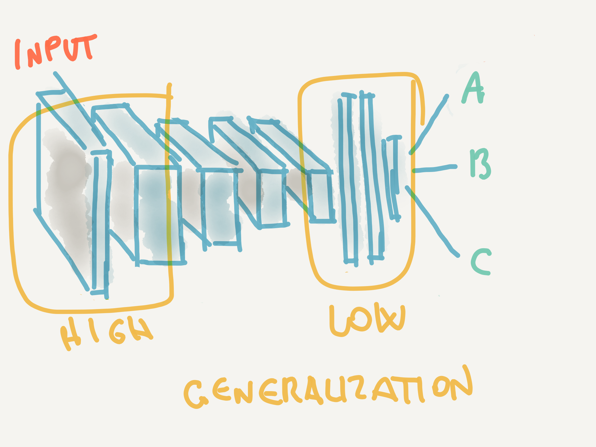
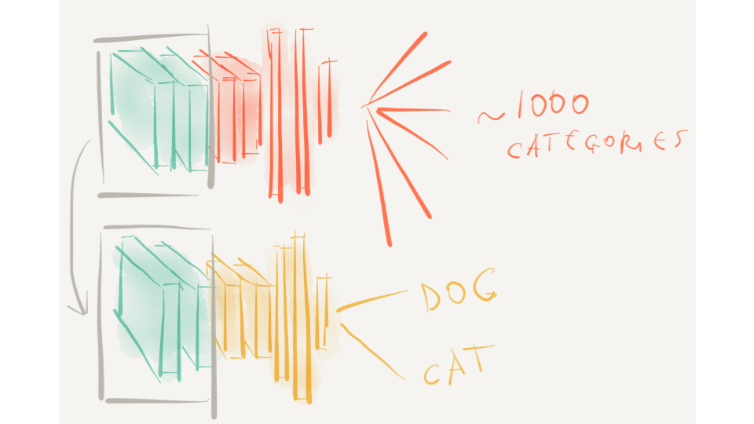

# Transfer learning
## Making your ConvNets great since 2014

### Convolutional neural networks (CNN): the context
Many deep neural networks trained on natural images exhibit a curious phenomenon in common: on the first layer they learn features similar to Gabor filters and color blobs. The appearance of these filters is very common, and made researchers understand that such first layers are not _specific_ for a certain task or a dataset, but they can truly build the foundation of a _general_ learning system.
This phenomenon occurs not only for different datasets, but even with very different training objectives, including supervised image classification (Krizhevsky et al., 2012), unsupervised density learning (Lee et al., 2009), and unsupervised learning of sparse  representations (Le et al., 2011).
On the other hand, generalization power is progressively lost by the terminal layers of the network, as neurons become more and more specialized and tied to the _specific_ classification problem they have been trained on.


======
__Fig.1__: The first convolutional layers in convnets tend to learn features similar to Gabor filters and color blobs

### What is 'transfer learning'?
It is often difficult (and computationally very expensive) to collect the amount of data needed to train CNNs from scratch (which is in order of tens of thousands of images). Instead, it is common to pretrain a ConvNet on a very large dataset (e.g. ImageNet, which contains 1.2 million images with 1000 categories), and then use the ConvNet as a fixed feature extractor for the task of interest (Razavian et al., 2014).


This means: take a ConvNet that has been pre-trained on ImageNet (a huge repository of images collected for this purpose), remove the last fully-connected layer (which as we have shown is specific for the task the network was trained for), then treat the rest of the ConvNet as a feature extractor for the new dataset. Once you extract the features for all images, train a classifier for the new dataset.

The effectiveness of transfer learning is supported by a vast amount of evidence, and some recent (empirical) findings have spurred much interest in the methodology, as:
- the transferability of features decreases as the distance between the base task and target task increases, but transferring features even from distant tasks can be better than using random features (Yosinski et al., 2014).
- initializing a network with transferred features from almost any number of layers can produce a boost to generalization that lingers even after fine-tuning to the target dataset (Yosinski et al., 2014).


======
__Fig.2__: Transfer learning: the green layers are borrowed from the first network and supplied as feature extractors to the second network (with frozen weights)

### Why it is useful
- With transfer learning it is possible to greatly reduce the need for computational power when training ConvNets, as a pre-trained network is being 'repurposed' to address a different task
- Reduced-size training set: the size of the input dataset to be used for training/evaluation varies according to the task at hand, but as a rule of thumb a dataset of at least ~300 images per class can be used to train a new ConvNet (as opposed to tens of thousand that we would need to train a network from scratch).

### Transfer learning approaches
Transfer learning takes two slightly different approaches (http://cs231n.github.io/transfer-learning/):
- __ConvNet as fixed feature extractor__ Take a ConvNet pretrained on ImageNet, remove the last fully-connected layer (this layer’s outputs are the 1000 class scores for a different task like ImageNet), then treat the rest of the ConvNet as a fixed feature extractor for the new dataset (as depicted in Fig.2)
- __Fine-tuning the ConvNet__ The second strategy is to not only replace and retrain the classifier on top of the ConvNet on the new dataset, but to also fine-tune the weights of the pretrained network by continuing the backpropagation. It is possible to fine-tune all the layers of the ConvNet, or it’s possible to keep some of the earlier layers fixed (due to overfitting concerns) and only fine-tune some higher-level portion of the network (more on this later)

### Transfer learning using inception-v3
The following code builds a model that classifies [Fender Stratocaster](https://en.wikipedia.org/wiki/Fender_Stratocaster), [Gibson Les Paul](https://en.wikipedia.org/wiki/Gibson_Les_Paul) and [Gibson SG](https://en.wikipedia.org/wiki/Gibson_SG) guitar pictures (In this regard, the [Flickr APIs](https://www.flickr.com/services/api/), Instagram or Google Image results are invaluable resources for the collection of training sets for ConvNets).

Model building is performed through two subsequent operations:
- __Transfer learning__: freeze all but the penultimate layer and re-train the last Dense layer
- __Fine-tuning__: un-freeze the lower convolutional layers and retrain more layers
Doing both, in that order, will ensure a more stable and consistent training.

The pre-trained ConvNet we will use for this tutorial is the Inception-v3, which is a ConvNet developed by Google (the default input size for this model is 299 x 299 with three channels).

(The following code has been written using the Keras 2.0.6 library with TensorFlow backend)


Let's first import the necessary libraries and instantiate the Inception-v3 model supported by Keras:
```python
from keras.applications.inception_v3 import InceptionV3 
from keras.preprocessing import image 
from keras.models import Model 
from keras.layers import Dense, GlobalAveragePooling2D 
from keras import backend as K 

# Instantiate the inception-V3 pre-trained model
base_model = InceptionV3( weights =' imagenet', include_top = False) 
```
`include_top` is set `False` in order to exclude the last three layers (including the final softmax layer with 200 classes of output). We are basically 'chopping off' the external layers to replace them with a classifier of our choice, to be refitted using a new training dataset.


We now stack on top of the Inception-V3 model (the 'chopped' version) our classifier. `x = GlobalAveragePooling2D()( x)` is used to convert the input to the correct shape for the dense layer to handle. This means that this function 'bridges' from the convolutional Inception V3 layers to the Dense layer that we use to classify our guitars in the final layers. 
```python
layer x = base_model.output x = GlobalAveragePooling2D()( x)
# let's add a fully-connected layer as first layer
x = Dense( 1024, activation ='relu')(x)
# and a logistic layer with 2 classes as the last layer (Les Paul vs Stratocaster)
predictions = Dense(3, activation ='softmax')(x)
# let's create a Keras model to be trained
model = Model( input = base_model.input, output = predictions)
```

All the convolutional InceptionV3 layers are frozen, so that training is allowed only for the external layers
```python
for layer in base_model.layers: 
    layer.trainable = False
```

Now our model is ready to be trained on the 'guitar' dataset: 
```python
# compile the model
model.compile( optimizer =' rmsprop', loss =' categorical_crossentropy') # train the model on the new data for a few epochs model.fit_generator(...)
```

Now freeze the first ~150 layers (an hyperparameter to be tuned) and 'unfreeze' the rest of the layers to perform fine-tuning:
```python
for layer in model.layers[: 150]: 
layer.trainable = False 

for layer in model.layers[ 150:]: 
layer.trainable = True
```


We train again using the Dense layer on top of _some_ inception layers. When fine-tuning, it’s important to lower your learning rate relative to the rate that was used when training from scratch (lr=0.0001), otherwise, the optimization could destabilize and the loss diverge.
```python
# We re-train again using SGD
from keras.optimizers import SGD 
model.compile( optimizer = SGD( lr = 0.0001, momentum = 0.9), 
               loss =' categorical_crossentropy')
        
# we train our model again (fine-tuning)
# alongside the top Dense layers 
model.fit_generator(...) 
```

We now have a deep network that has been trained on a new domain using the standard Inception V3 network, although (of course) there are many hyper-parameters that need to be fine-tuned in order to achieve a good level of accuracy. 
* part of the code referenced in this section has been ported and adapted from [here](https://github.com/PacktPublishing/Deep-Learning-with-Keras/blob/master/LICENSE)
