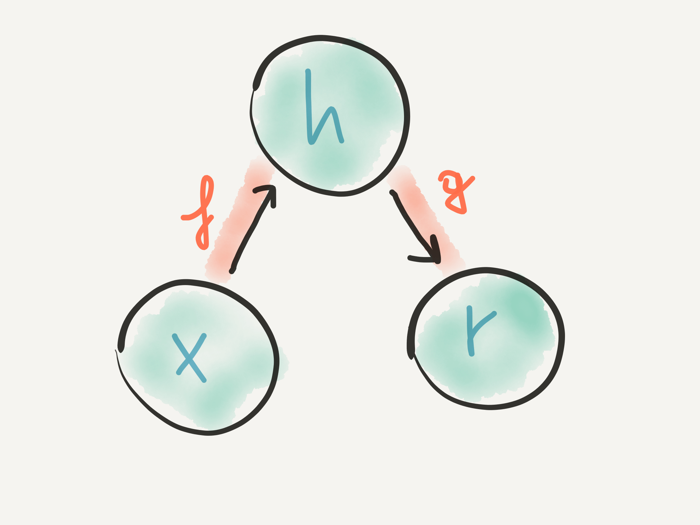
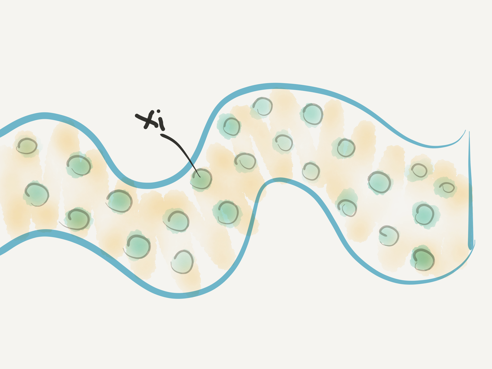
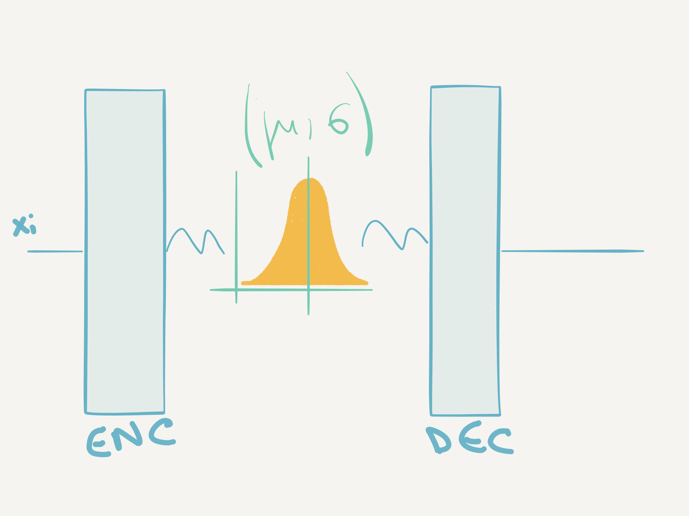

# Variational autoencoders
## The unsupervised wing of deep learning

### Autoencoders in brief 
An autoencoder is a neural network that consists of two parts, an encoder and a decoder. The encoder reads the input and compresses it to a compact representation (stored in the hidden layer _h_), while the decoder reads the compact representation and recreates the input from it.

======

__Fig.1__: The general structure of an autoencoder, mapping an input x to an output (called reconstruction) r through an internal representation or code h. The autoencoder has two components: the encoder _f_ (mapping _x_ to _h_) and the decoder _g_ (mapping _h_ to
_r_) ('Deep learning book', Goodfellow et al., 2017)

One way to obtain useful features from the autoencoder is to constrain _h_ to have smaller dimension than _x_. An autoencoder whose code dimension is less than the input dimension is called 'undercomplete'. Learning an undercomplete representation forces the autoencoder to capture the most salient features of the training data, similarly to what other dimensionality reduction techniques do (e.g. PCA and multidimensional scaling). Thus, the loss function to be minimized is the following (using the notation reported in Fig.1):

where _L_ is the loss function, the encoder is _f_ (mapping _x_ to _h_), while the decoder is _g_ (mapping _h_ to _r_)

Once the autoencoder is trained, we would typically just discard the decoder component and use the encoder component to generate compact representations of the input.
In fact, autoencoders were mainly used for dimensionality reduction or feature learning. Recently, theoretical connections between autoencoders and latent variable models have brought autoencoders to the forefront of generative modeling, and variational autoencoders have become one of the hottest topics in unsupervised learning. Interested readers can refer this tutorial by Jaan Altosaar: [https://jaan.io/what-is-variational-autoencoder-vae-tutorial/] 

\* in the present post I will not delve into the intricacies and advantages of stacking autoencoders and produce deep autoencoders, although experimentally deep autoencoders yield much better compression than corresponding linear autoencoders (Hinton and Salakhutdinov, 2006).

### Denoising autoencoder

A denoising autoencoder is an autoencoder that receives corrupted data as input and learns to predict the original uncorrupted version of the data (which is supplied during training).
Corrupted data points are generated from 
,  which represents a conditional distribution over corrupted samples  given a data sample 

The training strategy for denoising autoencoders is as follows:
1. Sample a training example  from the training data
2. Sample a corrupted version  from 
3. Use  as a training data point for error estimation

### Learning manifolds with autoencoders
Manifold learning is an approach to non-linear dimensionality reduction. Algorithms for this task are based on the idea that the dimensionality of many data sets is only artificially high, and can be reduced to a low-dimensional representation that (among other things) limits overfitting of learners that use this low-dimensional dataset as input.

Autoencoders characterize the manifold using a set of its _tangent planes_ (described by the training data). At a point _x_ on a d-dimensional manifold, the tangent plane is given by d basis vectors that span the local directions of variation allowed on the manifold. These local directions specify how one can change _x_ infinitesimally while staying on the manifold. 

What autoencoders learn is a function mapping between the data points _x_ and an internal _representation_ space. This mapping is only sensitive to changes along the manifold directions (while being insensitive to changes orthogonal to the manifold). By making the reconstruction function insensitive to perturbations of the input around the data points we recover the manifold structure.

The vector produced by the function that maps a single observation to the _representation_ space is called 'embedding', and can be used to build a nearest neighbour graph of training examples connected by 'proximity' arcs (Gong et al., 2000).

======

__Fig.2__: Each training example is represented by a tangent plane of the manifold. Different examples can be tiled/interpolated to produce a continous density function representing the manifold (the shaded plane)

As in k-NN, the generalization of the structure of the manifold is performed by interpolating neighboring points, which may result in inaccurate representations when dealing with manifolds with many 'peaks' and 'twists' (Bengio and Monperrus, 2005)

### Variational autoencoders

As I mentioned in the previous section, one particular type of autoencoder models is getting a lot of attention from the deep learning community.
From the description I have given in the last paragraphs of autoencoders their most appealing application seems to be related to the possibility of performing non-linear dimensionality reduction on input data. 

There is a way though to turn autoencoders into __generative models__ (e.g. to generate new images, sounds, text).
This is achieved by adding a constraint on the encoding network  that forces it to generate latent vectors that follow a unit gaussian distribution.
In order to generate new images/sounds/text we now just need to sample a latent vector from the unit gaussian and pass it into the decoder.

Mathematically, this is done by supplying an 'addendum' to the loss function we have encountered before (this is a form of regularization). The new component is the Kullbach-Leibner divergence, which for our purposes can simply be regarded as a dissimilarity metric between two distributions.

In the variational autoencoder,  is specified as a standard Normal distribution with mean zero and variance one. If the encoder outputs representations that are different than those from a standard normal distribution, it will receive a penalty in the loss. 

Generating new images/sounds/text is now easy: all we need to do is sample a latent vector from the unit gaussian and pass it into the decoder (see fig. below)

======

__Fig.3__: Intuition behind the use of autoencoders as generative models. Generating new images/sounds/text is now easy: all we need to do is sample a latent vector from the unit gaussian and pass it into the decoder

