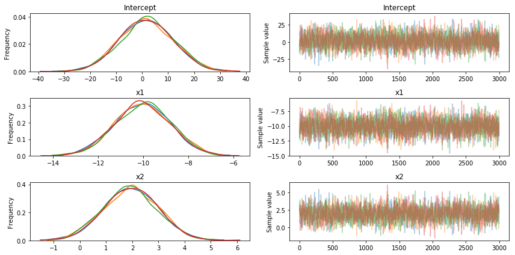
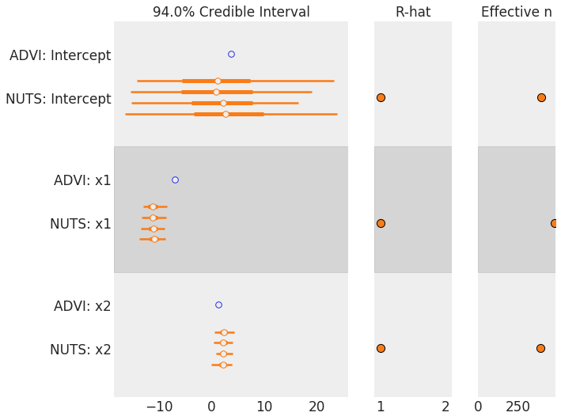
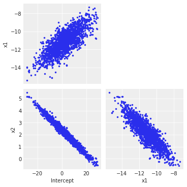
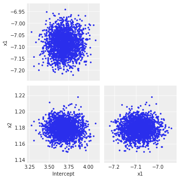

# Scalable Bayesian inference in Python
## On how variational inference makes probabilistic programming 'sustainable'

Last year I came across the [Edward project](http://edwardlib.org/) for probabilistic programming, which was later moved to a Tensorflow dev branch. Among the publications listed on the website, one caught my attention as it reported a truly innovative way (to my knowledge at least) to perform variational inference, titled: "Black box variational inference".
When performing bayesian inference we wish to approximate the posterior distribution of the latent variables given some data/observations x (), which is often intractable (just so you know, a latent variable is everything ranging from a discrete variable in a Gaussian mixture model to beta coefficients in a linear regression model or the scale parameter of the posterior distribution of a non-conjugate bayesian model). 
Characterization of the posterior is usually performed using Markov Chain Monte Carlo methods (yes, they come in different flavors), by repeatedly sampling from the (possibly super-complex and multivariate) posterior.
With variation inference instead, the basic idea is to pick an approximation  to the distribution from some tractable family, and then try to make this approximation as close as possible to the true posterior, : this reduces inference to an optimization problem. The key idea is to introduce a family of distributions over z that depend on variational parameters λ, , and find the values of λ that minimize the KL divergence between  and .

So why is this "black box" model so convenient? Citing from the publication:
"From the practitioner’s perspective, this method requires only that he or she write functions to evaluate the model log-likelihood. 
The remaining calculations (properties of the variational distribution and evaluating the Monte Carlo estimate) are easily put into a library to share across models, which means our method can be quickly applied to new modeling settings."


I will show you now how to run a logistic regression example, i.e. how to turn the formulas you have seen above in executable Python code that uses Pymc3's ADVI implementation as workhorse for optimization.
What is remarkable here is that performing variational inference with Pymc3 is as easy as running MCMC, as we just need to specificy the functional form of the distribution to sample from.

We will generate some random data:
```python
import pandas as pd
import pymc3 as pm
import matplotlib.pyplot as plt
import numpy as np

def logistic(x, b, noise=None):
    L = x.T.dot(b)
    if noise is not None:
        L = L+noise
    return 1/(1+np.exp(-L))

x1 = np.linspace(-10., 10, 10000)
x2 = np.linspace(0., 20, 10000)
bias = np.ones(len(x1))
X = np.vstack([x1,x2,bias]) # Add intercept
B =  [-10., 2., 1.] # Sigmoid params for X + intercept

# Noisy mean
pnoisy = logistic(X, B, noise=np.random.normal(loc=0., scale=0., size=len(x1)))
# dichotomize pnoisy -- sample 0/1 with probability pnoisy
y = np.random.binomial(1., pnoisy)
```
What we are doing here is just creating two variables (x1, x2) whose linear combination is run through a *sigmoid* function; after that we sample from a Binomial distribution with parameter p defined by the sigmoid output. The coefficients (betas) of the model are stored in the list 'B'.
At this point we use Pymc3 to define a probabilistic model for logistic regression and try to obtain a posterior distribution for each of the parameters (betas) defined above.
 ```python
with pm.Model() as model: 
    # Define priors
    intercept = pm.Normal('Intercept', 0, sd=10)
    x1_coef = pm.Normal('x1', 0, sd=10)
    x2_coef = pm.Normal('x2', 0, sd=10)

    # Define likelihood
    likelihood = pm.Bernoulli('y',                  
           pm.math.sigmoid(intercept+x1_coef*X[0]+x2_coef*X[1]),
                          observed=y)
    trace = pm.sample(3000)
    # pm.traceplot(trace) # plot results
```
These are results obtained with the standard Pymc3 sampler (NUTS):



The results are approximately what we expected: the maximum a posteriori (MAP) estimation coincides with the 'beta' parameters we used for data generation.
Let us try now a minor modification to introduce ADVI inference in this example:

```python
# Code is the same as in previous code block, except for:
from pymc3.variational.callbacks import CheckParametersConvergence

with model:
    fit = pm.fit(100_000, method='advi', callbacks=[CheckParametersConvergence()])

draws = fit.sample(2_000) # This will automatically check parameters convergence
```
ADVI is considerably **faster** than NUTS, but what about **accuracy**?
Instead of plotting bell curves again let us use this command to confront NUTS and ADVI results:

```python
import arviz as az
az.plot_forest([draws, trace])
```


ADVI is clearly underestimating the **variance**, but it is fairly close for the **mean** of each parameter. Let us try to visualize the covariance structure of the model to understand where this lack of precision may come from (a big thank to [colcarroll](https://stackoverflow.com/users/2620170/colcarroll) for pointing [this](https://stackoverflow.com/questions/52558826/why-is-pymc3-advi-worse-than-mcmc-in-this-logistic-regression-example) out):
```python
az.plot_pair(trace, figsize=(5, 5)) # Covariance plots for the NUTS trace
```


```python
az.plot_pair(draws, figsize=(5, 5)) # Covariance plots for the NUTS trace
```


Clearly, ADVI does not capture (as expected) the interactions between variables, and so it underestimated the overall variance by far (be advised: this is a particularly tricky example chosen to highlight this kind of behavior). 

## Conclusions
ADVI is a very convenient inferential procedure that let us characterize complex posterior distributions in a very short time (if compared to Gibbs/MCMC sampling). The solution it finds is a distribution which approximate the posterior: for most cases this may not be a problem, but we may need to pay extra-attention in cases when the covariance structure of the variables we are analyzing is crucial (this example that uses [Gaussian mixture models](https://docs.pymc.io/notebooks/gaussian-mixture-model-advi.html) may even further clarify what I mean)

## References
- Black Box variational inference, Rajesh Ranganath, Sean Gerrish, David M. Blei, AISTATS 2014
- [Keyonvafa's blog](http://keyonvafa.com/logistic-regression-bbvi/)